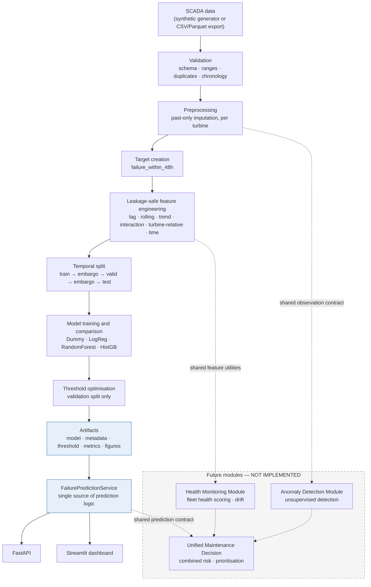
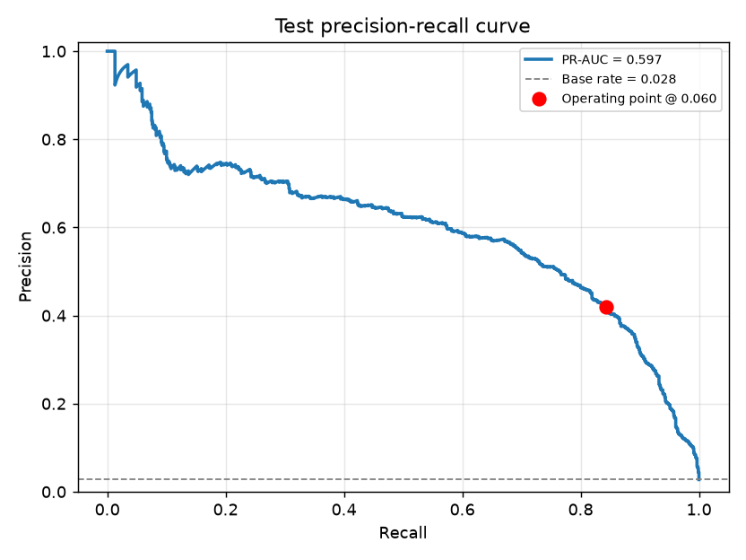
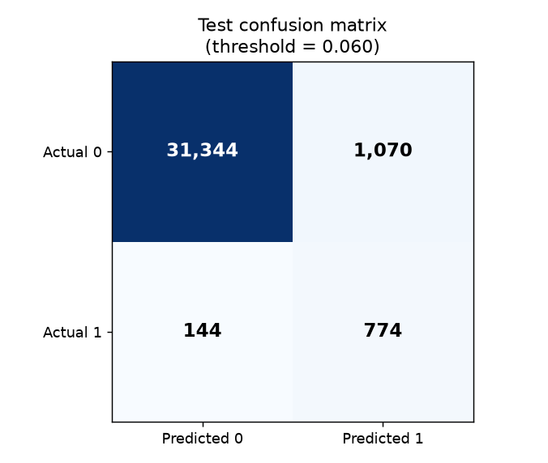
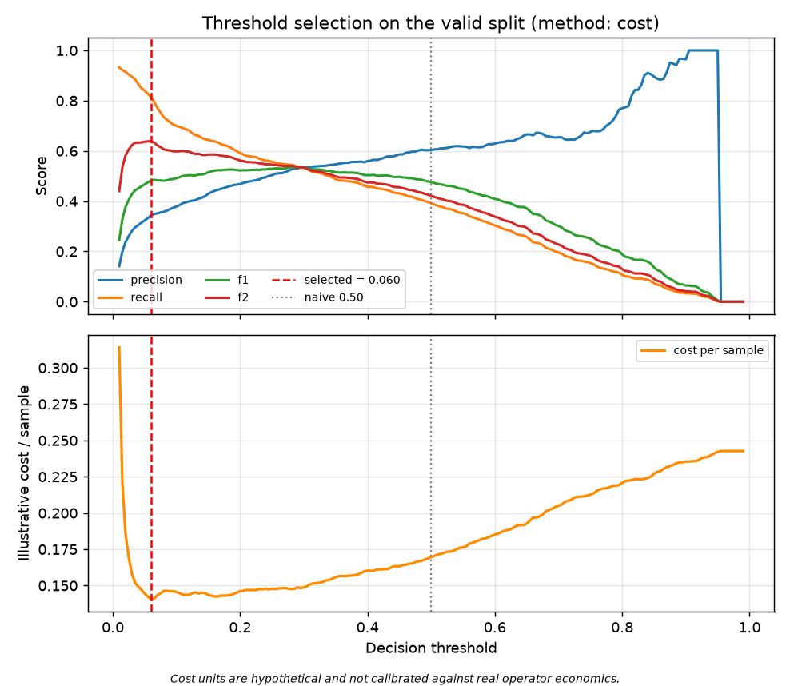
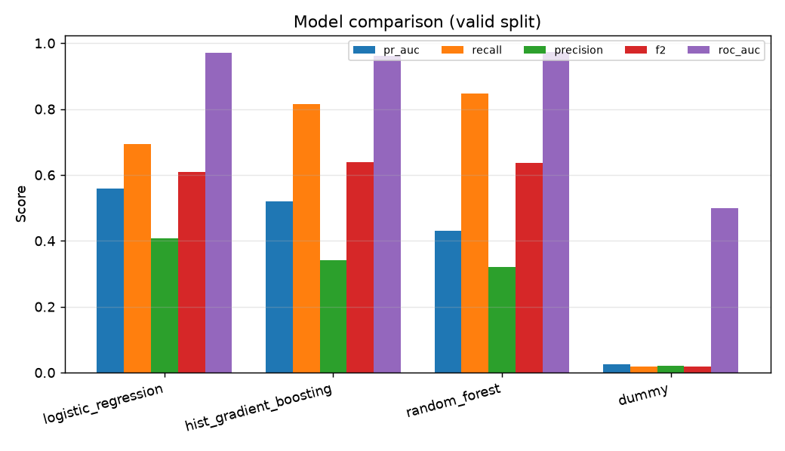
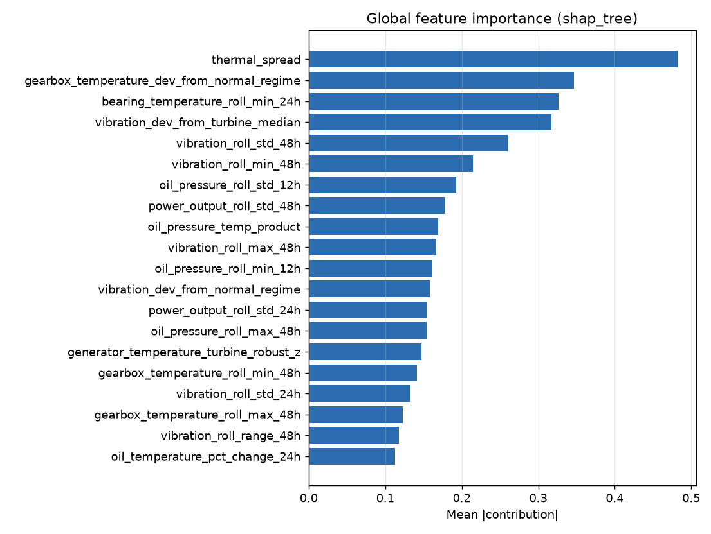
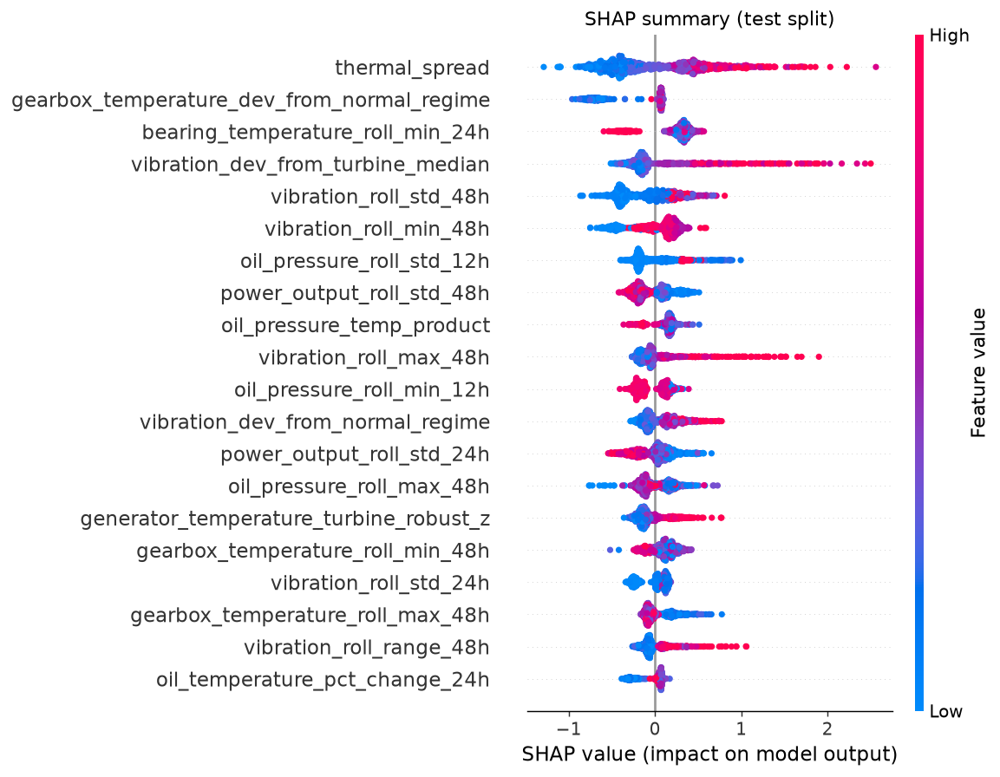
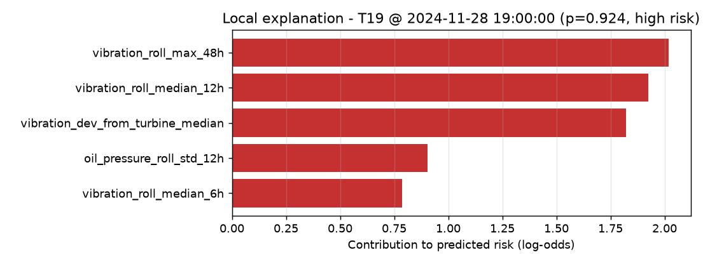

# Wind Turbine Predictive Maintenance Platform

[](https://github.com/SEO-Dynamics/Wind-Turbine-Predictive-Maintenance-Platform/actions/workflows/ci.yml)
[](https://www.python.org/downloads/)
[](https://github.com/astral-sh/ruff)
[](#testing)
[](LICENSE)
[](#9-synthetic-data-disclosure)
[](#26-limitations)

> **Module 1 of 3 — Failure Prediction.** This repository currently contains the Failure
> Prediction Module only. Turbine Health Monitoring and Anomaly Detection are planned
> follow-on stages and are **not implemented** — see [the roadmap](#27-future-modules).

---

## 3. Executive summary

This module estimates the probability that a wind turbine will experience a **failure
within the next 48 hours**, from SCADA sensor history, and explains why.

It is a complete, production-shaped system rather than a notebook: physics-grounded data
generation, a validation layer, leakage-safe feature engineering, chronological
validation with an embargo, four compared model families, cost-based threshold
optimisation, SHAP explanations, a reusable prediction service, a FastAPI backend, a
Streamlit dashboard, 162 tests, Docker and CI.

**Headline result on held-out test data (synthetic):**

| Metric | Test | Validation |
|---|---|---|
| PR-AUC | **0.597** | 0.520 |
| Recall | **0.843** | 0.814 |
| Precision | 0.420 | 0.342 |
| F2 | **0.702** | 0.638 |
| ROC-AUC | 0.976 | 0.962 |
| False-negative rate | **0.157** | 0.186 |

At a base rate of 2.2%, the model catches **84% of failures** while flagging only 5.5% of
observations. A stratified dummy baseline reaches PR-AUC 0.024 on the same data, so the
signal is learned rather than an artefact of the class balance.

**All output is advisory.** See [Limitations](#26-limitations).

---

## 4. Business problem

Unplanned wind turbine failures cause downtime, lost generation, emergency call-outs,
cascading component damage and avoidable safety exposure. Corrective repairs are
substantially more expensive than the planned inspection that could have prevented them,
and offshore or remote sites add mobilisation delay on top.

The value of an early warning is therefore **asymmetric**: missing a developing failure
is much worse than investigating one that turns out to be healthy. That asymmetry drives
three explicit design decisions in this module:

1. Accuracy is never used as a headline metric — predicting "no failure" everywhere
   already scores 97.8%.
2. The decision threshold is optimised against a cost function where a missed failure
   costs five times a false alarm, not left at the arbitrary 0.50.
3. Model selection applies a **recall floor**: a candidate that misses most failures is
   rejected regardless of how well it ranks.

---

## 5. Failure Prediction Module scope

**In scope (implemented and working):**

- SCADA data generation / ingestion, validation, preprocessing
- 48-hour failure target with documented edge-case handling
- Leakage-safe feature engineering (395 features across 7 groups)
- Chronological train/validation/test split with a 48-hour embargo
- Four model families trained, compared and ranked on validation only
- Threshold optimisation (F2 and cost methods)
- Risk banding, SHAP explanations, narrative generation, advisory recommendations
- Reusable `FailurePredictionService`, FastAPI backend, Streamlit dashboard
- Tests, Docker, CI, model card, handoff document

**Deliberately out of scope** (future modules — contracts exist, logic does not):
fleet health scoring, sensor-drift monitoring, unsupervised anomaly detection, a unified
cross-model risk score, and maintenance prioritisation across models.

---

## 6. Key features

| Area | What it does |
|---|---|
| **Leakage safety** | Every temporal operation is grouped by `turbine_id` and reads only past/current rows. Verified by tests that perturb the future and assert the past does not move. |
| **Temporal validation** | Chronological split with a 48-hour embargo at each boundary, because the label looks 48 hours forward. |
| **Honest metrics** | PR-AUC, recall, F2 and false-negative rate lead. Accuracy is reported but never used to select. |
| **Cost-aware threshold** | Optimised on validation against an explicit (hypothetical) cost matrix. Never 0.50 by default. |
| **Stable selection** | Near-ties in the primary metric are broken by recall/F2, so the winner does not flip on sub-percent noise. |
| **Grounded explanations** | Narratives are generated from actual SHAP values; when attribution is unavailable the text says so rather than inventing drivers. |
| **One prediction path** | API and dashboard both call the same service. Prediction logic is not duplicated. |
| **Graceful degradation** | Missing artifacts produce actionable messages with the exact command to run — never a traceback. |

---

## 7. System architecture



Dashed edges are **extension points**, not existing code. See
[`docs/OZAN_HANDOFF.md`](docs/OZAN_HANDOFF.md) for how to attach a module to each.

---

## 8. Dataset

**Decision:** no wind-turbine SCADA dataset with a public, stable, no-authentication
download endpoint was available that could be wired in without scraping or manual cookie
handling. Building on a fragile source would have made the whole project
non-reproducible, so this module ships a **synthetic generator** as its default source
and exposes a file-based ingestion path for a real export.

The generated dataset:

| Property | Value |
|---|---|
| Turbines | 20 |
| Frequency | hourly (configurable: `10min`, `30min`, …) |
| Coverage | 2024-01-01 → 2024-12-29 (363 days) |
| Raw rows | 175,820 |
| Rows after cleaning and eligibility filtering | 171,906 |
| Failure events | 80 |
| Positive rate (`failure_within_48h`) | 2.22% |
| Features generated | 395 |

### Physical relationships modelled

The generator is not a model of any specific commercial machine, but it is internally
consistent and reproduces relationships an engineer would expect:

- **Wind resource** — Ornstein-Uhlenbeck process with a shared site-level driver, a
  diurnal cycle and a seasonal cycle. Turbines are correlated but not identical.
- **Power curve** — zero below cut-in (3 m/s), cubic ramp to rated wind (12.5 m/s), flat
  at rated power (2000 kW) to cut-out (25 m/s), zero above.
- **Drivetrain** — rotor speed tracks wind up to rated; generator speed is rotor speed
  × gear ratio (97) plus slip noise. Measured correlation > 0.95.
- **Thermal inertia** — every temperature is a first-order lag toward a target that
  depends on ambient temperature and current load, so instantaneous temperature is *not*
  a deterministic function of load.
- **Lubrication** — oil pressure falls and becomes noisier as lubrication degrades; oil
  temperature then rises in response (poorer film → more friction).
- **Vibration** — scales with rotor speed and load, plus a degradation component that
  raises both level and variability, plus occasional transients.
- **Per-turbine baselines** — each turbine has its own mean wind speed, efficiency,
  thermal offset, vibration floor and failure propensity, which forces the model to use
  turbine-relative features rather than absolute thresholds.

### Operating states simulated

`normal`, `idle` (below cut-in / above cut-out), `derated`, `maintenance`, `fault`, plus
overheating, rising vibration, lubrication degradation, oil-pressure instability, sensor
noise, gradual pre-failure degradation, failure and post-maintenance recovery.

### Why the problem stays hard

**55% of degradation episodes end in a failure; 45% peak and heal on their own.** A
rising trend is therefore necessary but *not sufficient* evidence of an imminent failure.
Combined with per-turbine baselines, thermal inertia and noise, this means no single
sensor threshold separates the classes — the class-conditional distributions overlap
heavily (see the EDA notebook). The target is deliberately **not** encoded in any one
feature.

The raw file also contains **deliberately injected defects** — missing values (1.2% of
cells), physically impossible readings, duplicate rows and records with missing keys — so
the validation layer is exercised against real problems rather than mocks.

---

## 9. Synthetic data disclosure

> **All results in this README, in `artifacts/`, in the dashboard and in the API are
> produced on synthetic data generated by this project.** They are not measured from real
> turbines and do not constitute evidence of real-world performance. Synthetic data
> contains exactly the structure that was programmed into it, so a model learning that
> structure demonstrates that the *pipeline* works — not that the model would work on a
> real fleet.

The `is_synthetic` flag is carried through the model metadata, the `/failure/model-info`
and `/failure/metrics` API responses, and the dashboard's Limitations section, so the
disclosure cannot be lost downstream.

To use a real export instead, set in `configs/data.yaml`:

```yaml
data:
  source: file
  path: data/raw/your_scada_export.parquet
```

The file must satisfy the column contract in
[`docs/OZAN_HANDOFF.md`](docs/OZAN_HANDOFF.md). Nothing downstream changes.

---

## 10. Target definition

```
failure_within_48h
```

For observation *t* of turbine *k*, the label is **1** when at least one
`failure_event == 1` occurs for **that same turbine** in the half-open interval
`(t, t + 48h]`.

**Documented edge cases:**

| Case | Handling |
|---|---|
| Turbine boundaries | The look-ahead is computed inside `groupby(turbine_id)` and can never cross turbines. |
| The failure row itself | Labelled **0** — a failure at *t* has already happened, it is not "within the next 48 hours" of *t*. |
| End of a turbine's timeline | The final 48 hours cannot be labelled reliably (a failure just past the record end is invisible), so those rows are flagged `label_reliable = False` and **dropped**. This prevents systematic false negatives at the tail. |
| During `fault` / `maintenance` | **Dropped.** The failure is already known to the operator at that point; keeping these rows would leak the outcome and inflate measured performance. |
| After a repair | The 6 hours following a maintenance window are dropped as an unrepresentative post-maintenance transient. |
| Repeated labelling | One failure legitimately labels the 48 preceding observations — that *is* the task. Repairs reset degradation to zero, so consecutive failures produce disjoint positive windows. |

Verified by 13 tests in [`tests/test_target_creation.py`](tests/test_target_creation.py),
including an exact assertion that hourly data yields exactly 48 positives per failure.

---

## 11. Leakage prevention

Six structural defences, each backed by tests:

1. **Grouping** — every lag, rolling window, slope and expanding baseline runs inside
   `groupby("turbine_id")`.
2. **Trailing windows only** — rolling statistics end at the current row; nothing reads a
   larger index.
3. **Shifted baselines** — expanding means/medians are shifted one row, so an observation
   never contributes to the baseline it is compared against.
4. **No backward fill** — imputation forward-fills (past → present, limited to 3 steps on
   physically justified slow channels) or uses a robust per-turbine statistic.
5. **Preprocessing inside the pipeline** — imputers and scalers are `Pipeline` steps, so
   they are fitted on the training split by construction, never on the full dataset.
6. **Excluded columns and rows** — `failure_event`, `maintenance_event`,
   `degradation_level`, `hours_to_failure`, `episode_id` and `failure_mode` are
   ground-truth columns for EDA only and are configured out of the model matrix.

**Empirical verification** (`tests/test_failure_features.py`):

- Perturbing the *last* observation changes **no** earlier feature value.
- Perturbing turbine B changes **no** feature of turbine A.
- Truncating the future reproduces the past features exactly.
- Feature output is deterministic and order-stable under row shuffling.

A useful sanity signal: the strongest univariate feature-target correlation is ≈0.3, not
0.9. A near-perfect correlation would indicate a leak, not a discovery.

---

## 12. Feature engineering

395 features in 7 groups, all produced by the single entry point
`build_failure_features()` — the same function used in training, in the API and in the
dashboard, so serving-time features are computed identically to training-time features.

| Group | Count | Contents |
|---|---|---|
| `raw` | 19 | Current sensor readings + one-hot operating state |
| `lag` | 45 | Values 1/3/6/12/24 h ago |
| `rolling` | 170 | Trailing mean/std/min/max/median/range over 3/6/12/24/48 h |
| `trend` | 108 | Differences, rates, guarded % change, trailing OLS slopes, deviation from a 24 h baseline |
| `interaction` | 20 | Temperature rise above ambient, power-curve ratio and residual, rotor/generator speed ratio, vibration per load, oil pressure–temperature interaction, thermal stress index and spread |
| `turbine_relative` | 30 | Deviation from the turbine's own past-only expanding median/mean, robust z-score, deviation from its normal-regime baseline |
| `time` | 3 | Hour of day + cyclical encoding |

### A note on calendar features

`month` and `day_of_week` are **excluded by default**, which is a deliberate, measured
decision. Under a chronological split the training period covers one set of months and
the test period covers another, so the model can only ever meet unseen values at test
time. When they were enabled, `month` became the single highest-importance feature by
SHAP while *lowering* test PR-AUC from 0.604 to 0.572 — a spurious crutch, not signal.
Hour-of-day is kept because diurnal wind and thermal cycles genuinely repeat inside every
split. Set `features.time_features.components: [hour, day_of_week, month]` to re-enable
them; with multiple years of data, seasonality would be worth revisiting.

---

## 13. Temporal validation

A random split would be invalid here twice over: consecutive SCADA rows are strongly
autocorrelated, and the label looks 48 hours forward.

```
|<------- train ------->|<-48h->|<--- valid --->|<-48h->|<--- test --->|
                       embargo                 embargo
```

| Split | Period | Rows | Positive rate |
|---|---|---|---|
| Train | 2024-01-01 → 2024-08-06 | 103,233 | 1.93% |
| *(embargo)* | 48 h | — | excluded |
| Validation | 2024-08-08 → 2024-10-18 | 33,461 | 2.43% |
| *(embargo)* | 48 h | — | excluded |
| Test | 2024-10-20 → 2024-12-29 | 33,332 | 2.75% |

**Why the embargo is required:** an observation at `train_end − 10h` carries a label
determined by events up to `train_end + 38h`, which is validation-period information.
Removing a 48-hour band at each boundary makes that impossible. `compute_boundaries()`
**refuses to run** if the configured embargo is shorter than the target horizon.

All turbines appear in all three splits — the split is over *time*, not over turbines, so
the evaluation answers the operationally relevant question: *given everything known up to
time T, how well does the model do afterwards?*

---

## 14. Model comparison

Validation-split results at each candidate's own optimised threshold:

| Model | PR-AUC | ROC-AUC | Recall | Precision | F2 | Cost/sample | Train (s) | Outcome |
|---|---|---|---|---|---|---|---|---|
| Dummy (stratified) | 0.024 | 0.499 | 0.017 | 0.022 | 0.018 | 0.277 | 2.9 | reference baseline |
| Logistic Regression | **0.561** | 0.972 | 0.687 | **0.415** | 0.608 | **0.140** | 5.4 | near-tie, lost tie-break |
| Random Forest | 0.431 | 0.974 | **0.837** | 0.325 | 0.637 | 0.144 | 19.8 | **rejected** — PR-AUC guard rail |
| **HistGradientBoosting** | 0.520 | 0.962 | 0.814 | 0.342 | **0.638** | 0.141 | 58.3 | **selected** |

Gradient boosting is scikit-learn's `HistGradientBoostingClassifier` rather than XGBoost
or LightGBM: both require a platform-specific OpenMP runtime that is not reliably present
on macOS or slim Docker images, and the histogram-based scikit-learn implementation is
the same algorithm family with no extra dependency. This is the dependency-stability
trade-off, taken deliberately.

---

## 15. Final model selection

**Selected: `HistGradientBoostingClassifier`** (sigmoid-calibrated), version 1.0.0.

Selection is **not** "highest ROC-AUC wins" — note that Random Forest has the best
ROC-AUC (0.974) and was rejected outright. The procedure is:

1. **Recall floor.** Any candidate below 0.30 validation recall is rejected. A model that
   misses most failures is not useful whatever its ranking metric says.
2. **PR-AUC guard rail.** Any candidate more than 20% below the best PR-AUC is rejected.
   This removed Random Forest (0.431 vs 0.561) despite its strong recall — it buys recall
   with indiscriminate flagging.
3. **Primary metric: expected illustrative cost per observation** at each candidate's own
   optimised threshold. This directly encodes the FN:FP asymmetry the business problem
   has, which threshold-free PR-AUC cannot.
4. **Tolerance band.** Candidates within 5% of the best cost are treated as **tied**.
   Logistic Regression (0.1396) and HistGB (0.1409) differ by 0.9% — noise, not evidence.
5. **Tie-breakers: F2, recall, PR-AUC.** Among the tied pair, HistGB wins on F2 (0.638 vs
   0.608) and recall (0.814 vs 0.687).

**Rationale:** at effectively identical expected cost, HistGB catches 81% of validation
failures against Logistic Regression's 69% — 19 more true positives out of 812 — which is
the right trade for a recall-critical advisory task. It is also compatible with SHAP's
exact `TreeExplainer` (fast and exact, versus the slow permutation fallback needed for
the calibrated linear model), and scores a single row in 27 ms, far inside the budget for
an hourly-cadence service.

The tolerance band exists because without it the winner flipped between runs on
sub-percent differences.

---

## 16. Threshold optimisation

The default 0.50 is meaningless for a class-weighted rare-event classifier — it is an
artefact of the loss function, not an operating decision. Two methods are implemented and
both are recorded; the threshold is searched over a 197-point grid on the **validation
split only**.

| Method | Threshold | Description |
|---|---|---|
| **`cost` (selected)** | **0.060** | Minimises expected cost under the matrix below |
| `f2` | 0.055 | Maximises F-beta with β=2 (recall weighted 4× precision) |
| naive default | 0.50 | Not used |

**Illustrative cost matrix — these are hypothetical units, not calibrated against any
real operator's economics:**

| Outcome | Cost |
|---|---|
| False negative (missed failure) | 10 |
| False positive (unnecessary inspection) | 2 |
| True positive (acted-on warning) | 1 |
| True negative | 0 |

They encode "a missed failure is roughly five times worse than an unnecessary
inspection". They **must** be re-estimated from real operational economics before any
operational use.

**The test set never influences threshold selection** — `optimise_threshold()` raises if
passed `split_name="test"`.

Saved to `artifacts/metadata/failure_threshold.json`: the selected value, the method, the
split used, the cost assumptions, validation metrics at the threshold, and the thresholds
the other methods would have chosen. Curve: `artifacts/figures/threshold_curve.png`.

---

## 17. Evaluation results

All figures below were generated by executed code and read from
`artifacts/metrics/failure_metrics.json`. **Synthetic data.**

### Test split (held out, scored once)

| Metric | Value |
|---|---|
| Precision | 0.4197 |
| **Recall** | **0.8431** |
| F1 | 0.5605 |
| **F2** | **0.7016** |
| **PR-AUC** | **0.5973** |
| ROC-AUC | 0.9755 |
| **False-negative rate** | **0.1569** |
| False-positive rate | 0.0330 |
| Positive prediction rate | 0.0553 |
| Brier score | 0.0166 |
| Accuracy † | 0.9636 |
| Base rate | 0.0275 |

† Reported for completeness only. Predicting "no failure" everywhere scores 0.9725.

### Confusion matrix (test, threshold 0.060)

|  | Predicted 0 | Predicted 1 |
|---|---|---|
| **Actual 0** | 31,344 | 1,070 |
| **Actual 1** | 144 | **774** |

Read operationally: of 918 observations preceding a real failure, **774 were flagged**.
The cost is 1,070 false alarms out of 32,414 healthy observations (3.3%).

### Inference latency

| Mode | Time |
|---|---|
| Single row (`/failure/predict/prepared`) | 26.6 ms |
| Per row, batch of 5,000 | 0.006 ms |

### Figures

| Test precision-recall | Test confusion matrix |
|---|---|
|  |  |

**Threshold optimisation** — the selected point sits far from the naive 0.50, and the
lower panel shows why: expected cost is minimised near 0.06.



**Candidate comparison on validation** — note that Random Forest has the best ROC-AUC and
was still rejected.



The full set — including validation-split curves and the SHAP bar plot — is written to
`artifacts/figures/` by `make pipeline`:
`confusion_matrix_{valid,test}.png` · `pr_curve_{valid,test}.png` ·
`roc_curve_{valid,test}.png` · `threshold_curve.png` · `model_comparison.png` ·
`global_feature_importance.png` · `shap_summary.png` · `shap_bar.png` ·
`local_explanation_high_risk.png`

Metrics are saved as JSON (`artifacts/metrics/failure_metrics.json`) and CSV
(`model_comparison.csv`, `threshold_curve.csv`, `global_feature_importance.csv`).

---

## 18. Explainability

SHAP `TreeExplainer` (exact for the selected model), with a `PermutationExplainer` and
then scikit-learn permutation importance as documented fallbacks.

**Top global features** (mean |SHAP|, 1,000 test observations) — all genuine degradation
signals:

1. `thermal_spread` — temperature spread across drivetrain components
2. `gearbox_temperature_dev_from_normal_regime`
3. `bearing_temperature_roll_min_24h`
4. `vibration_dev_from_turbine_median`
5. `vibration_roll_std_48h`
6. `vibration_roll_min_48h`
7. `oil_pressure_roll_std_12h`
8. `power_output_roll_std_48h`
9. `oil_pressure_temp_product`
10. `vibration_roll_max_48h`

Vibration, drivetrain temperature and oil-pressure stability dominate — consistent with
the degradation mechanisms in the generator, and a useful check that the model learned
physics rather than an artefact.





### Worked local explanation

Highest-risk test observation, **T19 at 2024-11-28 19:00** — predicted probability
**92.4%**, risk level **high**, actual label **1**:

> The model estimates a 92.4% probability of failure within the prediction horizon (high
> risk). The estimate was pushed up mainly because 48-hour peak vibration, 12-hour
> average vibration and deviation of vibration from this turbine's usual level were
> outside the pattern the model associates with healthy operation.



Narratives are generated **from actual attribution values**. Feature names are decoded
structurally, so features added later are described correctly without code changes. When
no attribution is available the text says so explicitly rather than producing plausible
filler.

---

## 19. Risk levels

Probability bands are configurable and deliberately **independent of the binary decision
threshold** — a 0.06 threshold does not imply everything above 0.06 is "high risk".

| Level | Range |
|---|---|
| Low | `p < 0.30` |
| Medium | `0.30 ≤ p < 0.65` |
| High | `p ≥ 0.65` |

Consistency (`0 < low_max < medium_max < 1`) is validated at config load and again in the
model metadata contract.

---

## 20. Advisory recommendations

| Risk | Message |
|---|---|
| Low | Continue routine monitoring. No elevated failure indication was identified. |
| Medium | Review recent sensor trends and consider scheduling a non-urgent diagnostic inspection. *(names the contributing signals)* |
| High | Prioritise review of the identified risk factors by a qualified maintenance engineer before continued high-load operation. *(names the contributing signals)* |

Every message carries the standing disclaimer and is tested to contain no automation
language ("shut down", "automatically", "guaranteed").

---

## 21. API

FastAPI with Pydantic validation and Swagger docs at `/docs`. **The API never trains a
model** — artifacts are loaded lazily, so it starts cleanly even with none present and
reports `degraded` on `/health`.

| Method | Endpoint | Purpose |
|---|---|---|
| `GET` | `/` | Platform overview, mounted modules, roadmap |
| `GET` | `/health` | API status, model artifact status, version, timestamp |
| `GET` | `/failure/model-info` | Full model metadata and selection rationale |
| `GET` | `/failure/metrics` | Evaluation metrics (flagged synthetic) |
| `GET` | `/failure/features` | Feature contract — names in exact model order |
| `GET` | `/failure/example` | Ready-to-post example bodies for both modes |
| `POST` | `/failure/predict` | **Preferred** — raw observation window |
| `POST` | `/failure/predict/batch` | Batch of windows (≤200 turbines) |
| `POST` | `/failure/predict/prepared` | Fallback — precomputed feature vector |

### Two input modes, both fully implemented

- **`POST /failure/predict` (preferred)** accepts a window of **raw observations** and
  computes the features **inside the service**, using the same
  `build_failure_features()` call as training. Callers never reproduce feature
  engineering. Requires ≥72 hours of history so the 48-hour rolling windows are defined;
  a shorter window returns `422` with the required length.
- **`POST /failure/predict/prepared`** accepts a feature dictionary matching
  `GET /failure/features`. Missing features return `422` naming them.

### Example response

```json
{
  "turbine_id": "T19",
  "timestamp": "2024-11-28T19:00:00Z",
  "failure_probability": 0.923624,
  "prediction": 1,
  "risk_level": "high",
  "threshold": 0.06,
  "horizon_hours": 48,
  "top_risk_factors": [
    { "feature": "vibration_roll_max_48h", "impact": 0.41, "direction": "increases_risk",
      "value": 7.82, "description": "48-hour peak vibration was elevated" }
  ],
  "explanation": "The model estimates a 92.4% probability of failure ...",
  "recommendation": "Prioritise review of the identified risk factors by a qualified maintenance engineer ...",
  "model_version": "1.0.0",
  "advisory_only": true
}
```

### Error behaviour

| Status | Condition | Body |
|---|---|---|
| `422` | Schema violation | `{error: "validation_error", hint: "See GET /failure/example"}` |
| `422` | Window too short | `{error: "insufficient_history", hint: "Provide at least 72 hours"}` |
| `422` | Missing features | `{error: "feature_contract_violation", hint: "GET /failure/features"}` |
| `404` | No metrics artifact | `{error: "metrics_unavailable", hint: "python scripts/evaluate_failure_model.py"}` |
| `503` | No model artifact | `{error: "model_unavailable", hint: "python scripts/run_failure_pipeline.py"}` |

---

## 22. Dashboard

Streamlit, at `http://localhost:8501`. Navigation lists the built module and the planned
ones, clearly marked.

- **Executive summary** — turbines evaluated, high-risk count, mean probability,
  highest-risk turbine, model version, risk distribution. An **as-of slider** rescopes the
  whole fleet view to any point in the record, so it answers "what did the fleet look like
  at time T?" rather than being pinned to the last timestamp.
- **Fleet risk table** — turbine, probability, prediction, risk level, top risk factor;
  sortable and filterable by level and minimum probability.
- **Turbine detail** — select turbine, time range and sensors; probability timeline with
  threshold and risk bands, sensor trends, local risk factors, narrative and advisory.
- **Model performance** — full metric table, confusion matrix, PR/ROC curves, threshold
  optimisation, candidate comparison and the selection rationale.
- **Explainability** — global importance, SHAP summary and bar plots, worked local
  explanation, power curve.
- **Limitations** — synthetic status, advisory-only, validation requirement.

**The dashboard does not crash on missing artifacts.** Every section degrades to a
message plus the exact command needed. Prediction logic is not duplicated — it calls the
same `FailurePredictionService` as the API.

---

## 23. Project structure

```
wind-turbine-predictive-maintenance/
├── configs/                       # base · data · features · failure_model (YAML)
├── data/{raw,interim,processed,samples}/
├── artifacts/{models,metrics,figures,metadata}/
├── notebooks/01_failure_prediction_eda.ipynb
├── scripts/                       # generate · prepare · train · evaluate · run_pipeline
├── src/wind_turbine_pm/
│   ├── config.py  constants.py  logging_config.py
│   ├── contracts/                 # observations · predictions · metadata  ← SHARED
│   ├── data/                      # synthetic · ingestion · validation · preprocessing · splitting
│   ├── features/                  # failure_features · transformers
│   ├── models/                    # baselines · training · evaluation · threshold · persistence · prediction
│   ├── explainability/            # shap_explainer · narratives
│   ├── services/                  # failure_prediction_service  ← SHARED BY API + DASHBOARD
│   ├── api/                       # main · dependencies · schemas · routers/failure
│   └── utils/                     # io · paths · reproducibility
├── dashboard/{app.py,pages/,components/,data_access.py}
├── tests/                         # 162 tests
└── docs/OZAN_HANDOFF.md
```

---

## 24. Local installation

Requires **Python 3.12+**.

```bash
git clone https://github.com/SEO-Dynamics/Wind-Turbine-Predictive-Maintenance-Platform.git
cd wind-turbine-predictive-maintenance

python -m venv .venv
source .venv/bin/activate        # Windows: .venv\Scripts\activate

make install                     # or: pip install -r requirements.txt && pip install -e . --no-deps
```

<details>
<summary>If <code>import wind_turbine_pm</code> fails after an editable install</summary>

Some environments (notably sandboxed macOS shells) do not apply the `.pth` file that
`pip install -e .` writes. Set `PYTHONPATH` instead — every command below works with it:

```bash
export PYTHONPATH=src
```
</details>

### Training

```bash
make pipeline                    # full run: data → prepare → train → evaluate (~2.5 min)
```

Or stage by stage:

```bash
python scripts/generate_synthetic_data.py
python scripts/prepare_data.py
python scripts/train_failure_model.py
python scripts/evaluate_failure_model.py
python scripts/run_failure_pipeline.py
```

### Running the services

```bash
make api                         # uvicorn wind_turbine_pm.api.main:app --reload
make dashboard                   # streamlit run dashboard/app.py
```

| Service | URL |
|---|---|
| API | http://localhost:8000 |
| Swagger | http://localhost:8000/docs |
| Dashboard | http://localhost:8501 |

### All `make` targets

| Target | Direct equivalent |
|---|---|
| `make install` | `pip install -r requirements.txt && pip install -e . --no-deps` |
| `make data` | `python scripts/generate_synthetic_data.py` |
| `make prepare` | `python scripts/prepare_data.py` |
| `make train` | `python scripts/train_failure_model.py` |
| `make evaluate` | `python scripts/evaluate_failure_model.py` |
| `make pipeline` | `python scripts/run_failure_pipeline.py` |
| `make test` | `pytest` |
| `make lint` | `ruff check .` |
| `make format` | `ruff format . && ruff check --fix .` |
| `make api` | `uvicorn wind_turbine_pm.api.main:app --reload` |
| `make dashboard` | `streamlit run dashboard/app.py` |
| `make docs-figures` | refresh the result figures under `docs/images/` |
| `make docker-up` | `docker compose up --build` |
| `make clean` | remove caches |
| `make clean-all` | also remove generated data and artifacts |

### Testing

```bash
make test                        # 162 tests, ~14 s
```

Covering: synthetic data determinism and physics · validation findings · target
correctness and edge cases · feature leakage (turbine and temporal) · split ordering and
embargo · training, selection and tie-breaks · threshold bounds and risk mapping ·
service behaviour with and without artifacts · every API endpoint and error path.

Tests build their own small fixtures and never train a production-scale model.

---

## 25. Docker usage

```bash
docker compose up --build
```

Starts the API (`:8000`) and dashboard (`:8501`) from one image, with container health
checks. Both come up healthy in a few seconds; the first build takes ~2.5 minutes.

| Property | Detail |
|---|---|
| Base image | `python:3.13-slim` — **matches the training runtime exactly** |
| Dependencies | Pinned in `requirements.txt`, so the container's scikit-learn is the one that pickled the model |
| Artifact mounts | **Read-only** — neither service can train or mutate them (verified: writes fail with `Read-only file system`) |
| User | Non-root (`appuser`, uid 1000) |
| Training on startup | Never — artifacts are loaded lazily |

### Why the image pins its dependencies

A serialised scikit-learn estimator is only guaranteed to load under the version that
wrote it, and compose mounts the host's `artifacts/` into the container. An unpinned
image would happily unpickle a model built by a different scikit-learn and could
misbehave silently. So `requirements.txt` pins the scientific stack and the image uses
the same Python minor version as training. As defence in depth, `load_bundle()` compares
the runtime's `scikit-learn`/`numpy`/`joblib` versions against those recorded in the
model metadata and surfaces any mismatch in the logs and in `GET /health`
(`runtime_warnings`).

**Verified:** the containerised API and the host produce *bitwise identical* predictions
from the same artifact, and `runtime_warnings` is empty.

### Building artifacts inside Docker

Opt-in, so `docker compose up` never triggers training by accident:

```bash
docker compose --profile pipeline run --rm pipeline
```

This mounts `artifacts/` and `data/` writable and runs the full pipeline. **Verified:** it
reproduces the host-trained model exactly — identical metrics and bitwise-identical
predictions.

### If `docker compose` is not found

Homebrew's `docker-compose` formula installs a standalone binary, not the CLI plugin:

```bash
mkdir -p ~/.docker/cli-plugins
ln -sfn /opt/homebrew/opt/docker-compose/bin/docker-compose ~/.docker/cli-plugins/docker-compose
```

---

## 26. Limitations

**Read this before drawing any conclusion from the numbers above.**

- **Synthetic data.** Every result describes simulated data. The generator contains
  exactly the structure that was programmed into it. This demonstrates the pipeline
  works; it is **not** evidence the model would work on a real fleet.
- **Advisory only.** Decision support for qualified staff. It must never stop, start,
  derate or schedule maintenance on plant automatically.
- **Not a certified safety system.** It does not replace protection systems,
  condition-monitoring hardware, or engineering judgement.
- **Not validated in the real world.** Never evaluated against measured failures on
  operating turbines.
- **Precision is modest (0.42).** Roughly 3 in 5 flags are false alarms. That is a
  deliberate consequence of optimising for recall under an asymmetric cost matrix, but it
  has a real operational cost that must be budgeted for.
- **Costs are hypothetical.** The 10/2/1/0 matrix is illustrative and must be
  re-estimated from real economics.
- **Small number of failure events.** 80 failures over 20 turbines. Test metrics rest on
  ~19 distinct failure episodes, so confidence intervals are wide.
- **Per-turbine median imputation** uses a location statistic computed over the full
  history, which technically touches future rows. It is a scalar over a year of data, not
  an observation-level signal; the effect is negligible but it is a known deviation from
  strict past-only purity.
- **Calibration is fitted on the validation split**, and the threshold is optimised on
  the same split. This makes validation threshold metrics mildly optimistic. Test metrics
  are unaffected.
- **No drift monitoring.** Performance will degrade as turbines age and sensors drift.
  That is a future module's responsibility.
- **Single site, single year.** No seasonal generalisation can be claimed.

---

## 27. Future modules

**None of the following exist.** They are the planned next stages of this collaborative
project. This module provides contracts and extension points for them and must not need
restructuring when they arrive.

| Stage | Module | Scope | Status |
|---|---|---|---|
| 1 | **Failure Prediction** | 48-hour failure risk, explanation, advisory output | ✅ **Complete** |
| 2 | Turbine Health Monitoring | Fleet health scoring, component condition indices, sensor drift monitoring | ⏳ Planned |
| 3 | Anomaly Detection & Decision Support | Unsupervised anomaly detection, unified risk score, maintenance prioritisation | ⏳ Planned |

**Extension points already in place:**

- `contracts/observations.py` — shared `TurbineObservation` / `TurbineWindow` schema
- `contracts/predictions.py` — `BasePrediction` for any per-turbine model output
- `contracts/metadata.py` — `ModelMetadata` for any published model
- `api/main.py` — `MODULE_ROUTERS` list; add a router without touching failure code
- `dashboard/app.py` — `PAGES` list; add a page with one entry
- `features/transformers.py` — reusable leakage-safe temporal primitives
- `data/validation.py` — reusable validation layer
- Shared config structure and artifact directories

See [`docs/OZAN_HANDOFF.md`](docs/OZAN_HANDOFF.md) for the full contract documentation.

---

## 28. Ethical and operational considerations

- **Human oversight is required.** Every output is advisory and carries a disclaimer
  naming the need for review by a qualified maintenance engineer.
- **No autonomous control.** This model must never be wired to plant control. The
  `advisory_only: true` flag is a structural constant in the response contract, not a
  configurable field.
- **False negatives have physical consequences.** A missed failure can mean component
  destruction and safety exposure. This drives the recall-first design — and means the
  15.7% false-negative rate must be understood as a real residual risk, not a rounding
  error.
- **False positives have real costs too.** Unnecessary inspections consume technician
  time and can create their own safety exposure through unnecessary tower climbs.
- **Automation bias.** A confident-sounding probability with a fluent narrative can
  discourage independent judgement. Narratives are written to describe evidence, never to
  assert causes or certainty.
- **Transparency.** Synthetic-data status, the selection rationale, cost assumptions and
  known limitations are carried in the metadata, the API responses and the dashboard, so
  they cannot quietly be dropped.
- **Retraining and monitoring.** See [`MODEL_CARD.md`](MODEL_CARD.md).

---

## 29. License

[MIT](LICENSE).

Provided as-is, without warranty. Not certified for safety-critical industrial use.

---

## Documentation

| Document | Contents |
|---|---|
| [`CONTRIBUTING.md`](CONTRIBUTING.md) | Setup, branching, definition of done, platform non-negotiables |
| [`MODEL_CARD.md`](MODEL_CARD.md) | Intended use, out-of-scope use, metrics, risks, oversight, retraining |
| [`docs/OZAN_HANDOFF.md`](docs/OZAN_HANDOFF.md) | Data, feature, artifact and API contracts; extension points; stable files |
| [`notebooks/01_failure_prediction_eda.ipynb`](notebooks/01_failure_prediction_eda.ipynb) | Exploratory analysis and the leakage discussion |
