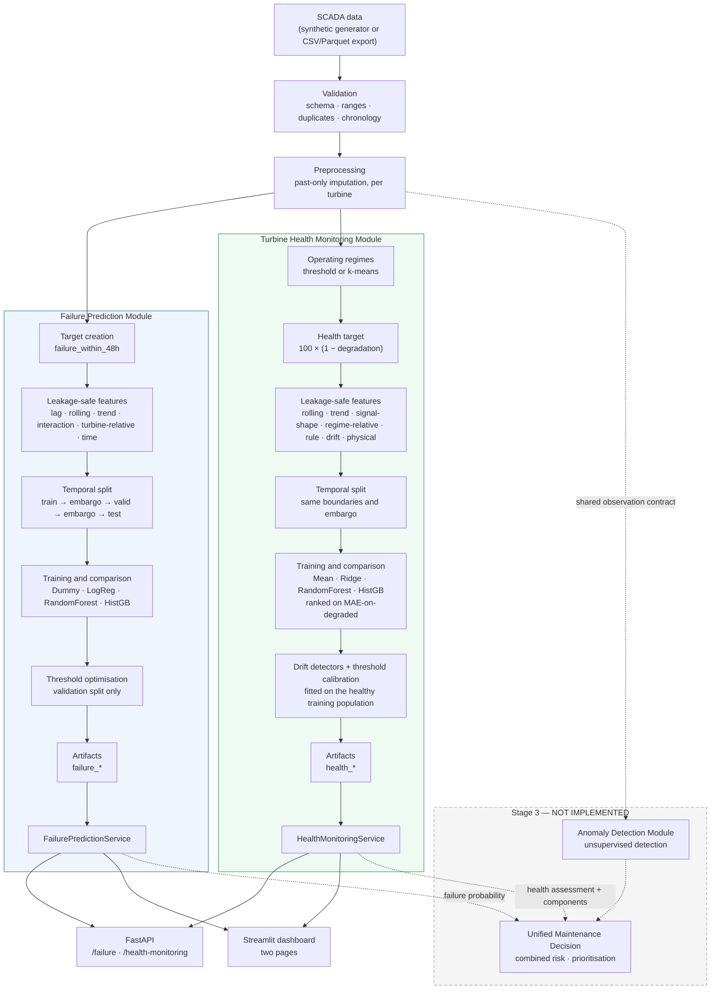

# Wind Turbine Predictive Maintenance Platform

[](https://github.com/SEO-Dynamics/Wind-Turbine-Predictive-Maintenance-Platform/actions/workflows/ci.yml)
[](https://www.python.org/downloads/)
[](https://github.com/astral-sh/ruff)
[](#testing)
[](LICENSE)
[](#9-synthetic-data-disclosure)
[](#27-limitations)

> **Modules 1 and 2 of 3 — Failure Prediction and Turbine Health Monitoring.** Both are
> implemented and serve from one API and one dashboard. Anomaly Detection & Maintenance
> Decision Support is a planned follow-on stage and is **not implemented** — see
> [the roadmap](#28-future-modules).

---

## 3. Executive summary

Two modules answer two different questions about the same fleet, from the same SCADA
history:

* **Failure Prediction** — *"is something about to break?"* Estimates the probability that
  a turbine will experience a **failure within the next 48 hours**, and explains why.
* **Turbine Health Monitoring** — *"what condition is this machine in, and is it getting
  worse?"* Scores current condition **0-100**, bands it into Healthy / Monitor / Degraded /
  Critical, attributes it to named components, and cross-checks it against sensor drift.

Both are production-shaped rather than notebooks: physics-grounded data generation, a
validation layer, leakage-safe feature engineering, chronological validation with an
embargo, compared model families with guard-railed selection, grounded explanations,
reusable services, one FastAPI backend, one Streamlit dashboard, 390 tests, Docker and CI.

**Failure Prediction — held-out test data (synthetic):**

| Metric | Test | Validation |
|---|---|---|
| PR-AUC | **0.597** | 0.520 |
| Recall | **0.843** | 0.814 |
| Precision | 0.420 | 0.342 |
| F2 | **0.702** | 0.638 |
| ROC-AUC | 0.976 | 0.962 |
| False-negative rate | **0.157** | 0.186 |

At a base rate of 2.2%, the model catches **84% of failures** while flagging only 5.5% of
observations. A stratified dummy baseline reaches PR-AUC 0.024 on the same data, so the
signal is learned rather than an artefact of the class balance.

**Turbine Health Monitoring — held-out test data (synthetic):**

| Metric | Test | Meaning |
|---|---|---|
| MAE | 6.46 | Mean absolute error in score points |
| **MAE on degraded** | **6.27** | Error where the true score is below 60 — the primary selection metric |
| RMSE | 7.16 | |
| Spearman | 0.599 | Rank correlation with true condition — does it order turbines correctly |
| **Class agreement** | **0.973** | Share placed in the correct health band |
| Optimistic rate | 0.000-0.043 | Share placed in a *healthier* band than the truth, per band |

A mean-prediction baseline reaches MAE 11.58 and MAE-on-degraded 58.67, so the score is
learned. Selection is led by error **on degraded observations** rather than overall error,
because 88% of observations are healthy and an overall figure is carried by that majority.

**All output is advisory.** See [Limitations](#27-limitations).

---

## 4. Business problem

Unplanned wind turbine failures cause downtime, lost generation, emergency call-outs,
cascading component damage and avoidable safety exposure. Corrective repairs are
substantially more expensive than the planned inspection that could have prevented them,
and offshore or remote sites add mobilisation delay on top.

The value of an early warning is therefore **asymmetric**: missing a developing failure
is much worse than investigating one that turns out to be healthy. That asymmetry drives
three explicit design decisions in this module:

1. Accuracy is never used as a headline metric — predicting "no failure" everywhere
   already scores 97.8%.
2. The decision threshold is optimised against a cost function where a missed failure
   costs five times a false alarm, not left at the arbitrary 0.50.
3. Model selection applies a **recall floor**: a candidate that misses most failures is
   rejected regardless of how well it ranks.

---

## 5. Module scope

**Failure Prediction — in scope, implemented and working:**

- SCADA data generation / ingestion, validation, preprocessing
- 48-hour failure target with documented edge-case handling
- Leakage-safe feature engineering (395 features across 7 groups)
- Chronological train/validation/test split with a 48-hour embargo
- Four model families trained, compared and ranked on validation only
- Threshold optimisation (F2 and cost methods)
- Risk banding, SHAP explanations, narrative generation, advisory recommendations
- Reusable `FailurePredictionService`

**Turbine Health Monitoring — in scope, implemented and working:**

- Sensor validation rules: physical limits plus operating-envelope limits, each with its
  provenance and rationale, including frozen-signal and impossible-slew detection
- Operating-regime detection (threshold and k-means) conditioning everything downstream
- Leakage-safe health feature engineering (239 features across 8 groups)
- 0-100 condition regression with guard-railed, `mae_degraded`-led selection
- Health classification into Healthy / Monitor / Degraded / Critical, with optional
  adaptive bands
- Sensor-drift detection (CUSUM, EWMA, Isolation Forest) with thresholds calibrated
  against the fleet's own healthy population, and a capped drift penalty
- Auditable per-component roll-up naming which subsystem is driving the score
- Reusable `HealthMonitoringService`

**Shared across both:** one FastAPI backend, one Streamlit dashboard, 390 tests, Docker, CI,
a model card per module and a handoff contract.

**Deliberately out of scope** (Stage 3 — contracts exist, logic does not): unsupervised
anomaly detection, a unified cross-model risk score, and maintenance prioritisation across
models.

---

## 6. Key features

| Area | What it does |
|---|---|
| **Leakage safety** | Every temporal operation is grouped by `turbine_id` and reads only past/current rows. Verified by tests that perturb the future and assert the past does not move. |
| **Temporal validation** | Chronological split with a 48-hour embargo at each boundary, because the label looks 48 hours forward. |
| **Honest metrics** | PR-AUC, recall, F2 and false-negative rate lead. Accuracy is reported but never used to select. |
| **Cost-aware threshold** | Optimised on validation against an explicit (hypothetical) cost matrix. Never 0.50 by default. |
| **Stable selection** | Near-ties in the primary metric are broken by recall/F2, so the winner does not flip on sub-percent noise. |
| **Grounded explanations** | Narratives are generated from actual SHAP values (failure) or actual rule margins and own-baseline deviations (health); when there is no evidence the text says so rather than inventing drivers. |
| **One prediction path per module** | API and dashboard call the same service. Prediction logic is not duplicated, and the two dashboard views of a turbine are derived from the same feature matrix so they cannot disagree. |
| **Graceful degradation** | Missing artifacts produce actionable messages with the exact command to run — never a traceback. Each module degrades independently. |
| **Regime conditioning** | A sensor value is judged against what the machine was doing: every health baseline is conditioned on the operating regime, so a windy site is not scored unhealthy for running hot. |
| **Calibrated detectors, not textbook constants** | Drift limits are set from the fleet's own healthy population with a recorded false-alarm rate, because the textbook control-chart constants assume independent residuals that hourly SCADA data does not provide. |
| **Auditable attribution** | Component scores trace to a limit an engineer can check against the raw trend, which the dashboard plots beside them, rather than to a model decomposition the training objective never constrained. |

---

## 7. System architecture

Both modules share the ingestion, validation and cleaning layers and the same raw dataset,
then diverge into their own feature pipeline, model and service.



Dashed edges are **extension points**, not existing code. See
[`docs/OZAN_HANDOFF.md`](docs/OZAN_HANDOFF.md) for how to attach a module to each, and §12
of that document for the health contract Stage 3 can consume.

---

## 8. Dataset

**Decision:** no wind-turbine SCADA dataset with a public, stable, no-authentication
download endpoint was available that could be wired in without scraping or manual cookie
handling. Building on a fragile source would have made the whole project
non-reproducible, so this module ships a **synthetic generator** as its default source
and exposes a file-based ingestion path for a real export.

The generated dataset:

| Property | Value |
|---|---|
| Turbines | 20 |
| Frequency | hourly (configurable: `10min`, `30min`, …) |
| Coverage | 2024-01-01 → 2024-12-29 (363 days) |
| Raw rows | 175,820 |
| Rows after cleaning and eligibility filtering | 171,906 |
| Failure events | 80 |
| Positive rate (`failure_within_48h`) | 2.22% |
| Features generated | 395 |

### Physical relationships modelled

The generator is not a model of any specific commercial machine, but it is internally
consistent and reproduces relationships an engineer would expect:

- **Wind resource** — Ornstein-Uhlenbeck process with a shared site-level driver, a
  diurnal cycle and a seasonal cycle. Turbines are correlated but not identical.
- **Power curve** — zero below cut-in (3 m/s), cubic ramp to rated wind (12.5 m/s), flat
  at rated power (2000 kW) to cut-out (25 m/s), zero above.
- **Drivetrain** — rotor speed tracks wind up to rated; generator speed is rotor speed
  × gear ratio (97) plus slip noise. Measured correlation > 0.95.
- **Thermal inertia** — every temperature is a first-order lag toward a target that
  depends on ambient temperature and current load, so instantaneous temperature is *not*
  a deterministic function of load.
- **Lubrication** — oil pressure falls and becomes noisier as lubrication degrades; oil
  temperature then rises in response (poorer film → more friction).
- **Vibration** — scales with rotor speed and load, plus a degradation component that
  raises both level and variability, plus occasional transients.
- **Per-turbine baselines** — each turbine has its own mean wind speed, efficiency,
  thermal offset, vibration floor and failure propensity, which forces the model to use
  turbine-relative features rather than absolute thresholds.

### Operating states simulated

`normal`, `idle` (below cut-in / above cut-out), `derated`, `maintenance`, `fault`, plus
overheating, rising vibration, lubrication degradation, oil-pressure instability, sensor
noise, gradual pre-failure degradation, failure and post-maintenance recovery.

### Why the problem stays hard

**55% of degradation episodes end in a failure; 45% peak and heal on their own.** A
rising trend is therefore necessary but *not sufficient* evidence of an imminent failure.
Combined with per-turbine baselines, thermal inertia and noise, this means no single
sensor threshold separates the classes — the class-conditional distributions overlap
heavily (see the EDA notebook). The target is deliberately **not** encoded in any one
feature.

The raw file also contains **deliberately injected defects** — missing values (1.2% of
cells), physically impossible readings, duplicate rows and records with missing keys — so
the validation layer is exercised against real problems rather than mocks.

---

## 9. Synthetic data disclosure

> **All results in this README, in `artifacts/`, in the dashboard and in the API are
> produced on synthetic data generated by this project.** They are not measured from real
> turbines and do not constitute evidence of real-world performance. Synthetic data
> contains exactly the structure that was programmed into it, so a model learning that
> structure demonstrates that the *pipeline* works — not that the model would work on a
> real fleet.

The `is_synthetic` flag is carried through the model metadata, the `/failure/model-info`
and `/failure/metrics` API responses, and the dashboard's Limitations section, so the
disclosure cannot be lost downstream.

To use a real export instead, set in `configs/data.yaml`:

```yaml
data:
  source: file
  path: data/raw/your_scada_export.parquet
```

The file must satisfy the column contract in
[`docs/OZAN_HANDOFF.md`](docs/OZAN_HANDOFF.md). Nothing downstream changes.

---

## 10. Target definition

```
failure_within_48h
```

For observation *t* of turbine *k*, the label is **1** when at least one
`failure_event == 1` occurs for **that same turbine** in the half-open interval
`(t, t + 48h]`.

**Documented edge cases:**

| Case | Handling |
|---|---|
| Turbine boundaries | The look-ahead is computed inside `groupby(turbine_id)` and can never cross turbines. |
| The failure row itself | Labelled **0** — a failure at *t* has already happened, it is not "within the next 48 hours" of *t*. |
| End of a turbine's timeline | The final 48 hours cannot be labelled reliably (a failure just past the record end is invisible), so those rows are flagged `label_reliable = False` and **dropped**. This prevents systematic false negatives at the tail. |
| During `fault` / `maintenance` | **Dropped.** The failure is already known to the operator at that point; keeping these rows would leak the outcome and inflate measured performance. |
| After a repair | The 6 hours following a maintenance window are dropped as an unrepresentative post-maintenance transient. |
| Repeated labelling | One failure legitimately labels the 48 preceding observations — that *is* the task. Repairs reset degradation to zero, so consecutive failures produce disjoint positive windows. |

Verified by 13 tests in [`tests/test_target_creation.py`](tests/test_target_creation.py),
including an exact assertion that hourly data yields exactly 48 positives per failure.

---

## 11. Leakage prevention

Six structural defences, each backed by tests:

1. **Grouping** — every lag, rolling window, slope and expanding baseline runs inside
   `groupby("turbine_id")`.
2. **Trailing windows only** — rolling statistics end at the current row; nothing reads a
   larger index.
3. **Shifted baselines** — expanding means/medians are shifted one row, so an observation
   never contributes to the baseline it is compared against.
4. **No backward fill** — imputation forward-fills (past → present, limited to 3 steps on
   physically justified slow channels) or uses a robust per-turbine statistic.
5. **Preprocessing inside the pipeline** — imputers and scalers are `Pipeline` steps, so
   they are fitted on the training split by construction, never on the full dataset.
6. **Excluded columns and rows** — `failure_event`, `maintenance_event`,
   `degradation_level`, `hours_to_failure`, `episode_id` and `failure_mode` are
   ground-truth columns for EDA only and are configured out of the model matrix.

**Empirical verification** (`tests/test_failure_features.py`):

- Perturbing the *last* observation changes **no** earlier feature value.
- Perturbing turbine B changes **no** feature of turbine A.
- Truncating the future reproduces the past features exactly.
- Feature output is deterministic and order-stable under row shuffling.

A useful sanity signal: the strongest univariate feature-target correlation is ≈0.3, not
0.9. A near-perfect correlation would indicate a leak, not a discovery.

---

## 12. Feature engineering

395 features in 7 groups, all produced by the single entry point
`build_failure_features()` — the same function used in training, in the API and in the
dashboard, so serving-time features are computed identically to training-time features.

| Group | Count | Contents |
|---|---|---|
| `raw` | 19 | Current sensor readings + one-hot operating state |
| `lag` | 45 | Values 1/3/6/12/24 h ago |
| `rolling` | 170 | Trailing mean/std/min/max/median/range over 3/6/12/24/48 h |
| `trend` | 108 | Differences, rates, guarded % change, trailing OLS slopes, deviation from a 24 h baseline |
| `interaction` | 20 | Temperature rise above ambient, power-curve ratio and residual, rotor/generator speed ratio, vibration per load, oil pressure–temperature interaction, thermal stress index and spread |
| `turbine_relative` | 30 | Deviation from the turbine's own past-only expanding median/mean, robust z-score, deviation from its normal-regime baseline |
| `time` | 3 | Hour of day + cyclical encoding |

### A note on calendar features

`month` and `day_of_week` are **excluded by default**, which is a deliberate, measured
decision. Under a chronological split the training period covers one set of months and
the test period covers another, so the model can only ever meet unseen values at test
time. When they were enabled, `month` became the single highest-importance feature by
SHAP while *lowering* test PR-AUC from 0.604 to 0.572 — a spurious crutch, not signal.
Hour-of-day is kept because diurnal wind and thermal cycles genuinely repeat inside every
split. Set `features.time_features.components: [hour, day_of_week, month]` to re-enable
them; with multiple years of data, seasonality would be worth revisiting.

---

## 13. Temporal validation

A random split would be invalid here twice over: consecutive SCADA rows are strongly
autocorrelated, and the label looks 48 hours forward.

```
|<------- train ------->|<-48h->|<--- valid --->|<-48h->|<--- test --->|
                       embargo                 embargo
```

| Split | Period | Rows | Positive rate |
|---|---|---|---|
| Train | 2024-01-01 → 2024-08-06 | 103,233 | 1.93% |
| *(embargo)* | 48 h | — | excluded |
| Validation | 2024-08-08 → 2024-10-18 | 33,461 | 2.43% |
| *(embargo)* | 48 h | — | excluded |
| Test | 2024-10-20 → 2024-12-29 | 33,332 | 2.75% |

**Why the embargo is required:** an observation at `train_end − 10h` carries a label
determined by events up to `train_end + 38h`, which is validation-period information.
Removing a 48-hour band at each boundary makes that impossible. `compute_boundaries()`
**refuses to run** if the configured embargo is shorter than the target horizon.

All turbines appear in all three splits — the split is over *time*, not over turbines, so
the evaluation answers the operationally relevant question: *given everything known up to
time T, how well does the model do afterwards?*

---

## 14. Model comparison

Validation-split results at each candidate's own optimised threshold:

| Model | PR-AUC | ROC-AUC | Recall | Precision | F2 | Cost/sample | Train (s) | Outcome |
|---|---|---|---|---|---|---|---|---|
| Dummy (stratified) | 0.024 | 0.499 | 0.017 | 0.022 | 0.018 | 0.277 | 2.9 | reference baseline |
| Logistic Regression | **0.561** | 0.972 | 0.687 | **0.415** | 0.608 | **0.140** | 5.4 | near-tie, lost tie-break |
| Random Forest | 0.431 | 0.974 | **0.837** | 0.325 | 0.637 | 0.144 | 19.8 | **rejected** — PR-AUC guard rail |
| **HistGradientBoosting** | 0.520 | 0.962 | 0.814 | 0.342 | **0.638** | 0.141 | 58.3 | **selected** |

Gradient boosting is scikit-learn's `HistGradientBoostingClassifier` rather than XGBoost
or LightGBM: both require a platform-specific OpenMP runtime that is not reliably present
on macOS or slim Docker images, and the histogram-based scikit-learn implementation is
the same algorithm family with no extra dependency. This is the dependency-stability
trade-off, taken deliberately.

---

## 15. Final model selection

**Selected: `HistGradientBoostingClassifier`** (sigmoid-calibrated), version 1.0.0.

Selection is **not** "highest ROC-AUC wins" — note that Random Forest has the best
ROC-AUC (0.974) and was rejected outright. The procedure is:

1. **Recall floor.** Any candidate below 0.30 validation recall is rejected. A model that
   misses most failures is not useful whatever its ranking metric says.
2. **PR-AUC guard rail.** Any candidate more than 20% below the best PR-AUC is rejected.
   This removed Random Forest (0.431 vs 0.561) despite its strong recall — it buys recall
   with indiscriminate flagging.
3. **Primary metric: expected illustrative cost per observation** at each candidate's own
   optimised threshold. This directly encodes the FN:FP asymmetry the business problem
   has, which threshold-free PR-AUC cannot.
4. **Tolerance band.** Candidates within 5% of the best cost are treated as **tied**.
   Logistic Regression (0.1396) and HistGB (0.1409) differ by 0.9% — noise, not evidence.
5. **Tie-breakers: F2, recall, PR-AUC.** Among the tied pair, HistGB wins on F2 (0.638 vs
   0.608) and recall (0.814 vs 0.687).

**Rationale:** at effectively identical expected cost, HistGB catches 81% of validation
failures against Logistic Regression's 69% — 19 more true positives out of 812 — which is
the right trade for a recall-critical advisory task. It is also compatible with SHAP's
exact `TreeExplainer` (fast and exact, versus the slow permutation fallback needed for
the calibrated linear model), and scores a single row in 27 ms, far inside the budget for
an hourly-cadence service.

The tolerance band exists because without it the winner flipped between runs on
sub-percent differences.

---

## 16. Threshold optimisation

The default 0.50 is meaningless for a class-weighted rare-event classifier — it is an
artefact of the loss function, not an operating decision. Two methods are implemented and
both are recorded; the threshold is searched over a 197-point grid on the **validation
split only**.

| Method | Threshold | Description |
|---|---|---|
| **`cost` (selected)** | **0.060** | Minimises expected cost under the matrix below |
| `f2` | 0.055 | Maximises F-beta with β=2 (recall weighted 4× precision) |
| naive default | 0.50 | Not used |

**Illustrative cost matrix — these are hypothetical units, not calibrated against any
real operator's economics:**

| Outcome | Cost |
|---|---|
| False negative (missed failure) | 10 |
| False positive (unnecessary inspection) | 2 |
| True positive (acted-on warning) | 1 |
| True negative | 0 |

They encode "a missed failure is roughly five times worse than an unnecessary
inspection". They **must** be re-estimated from real operational economics before any
operational use.

**The test set never influences threshold selection** — `optimise_threshold()` raises if
passed `split_name="test"`.

Saved to `artifacts/metadata/failure_threshold.json`: the selected value, the method, the
split used, the cost assumptions, validation metrics at the threshold, and the thresholds
the other methods would have chosen. Curve: `artifacts/figures/threshold_curve.png`.

---

## 17. Evaluation results

All figures below were generated by executed code and read from
`artifacts/metrics/failure_metrics.json`. **Synthetic data.**

### Test split (held out, scored once)

| Metric | Value |
|---|---|
| Precision | 0.4197 |
| **Recall** | **0.8431** |
| F1 | 0.5605 |
| **F2** | **0.7016** |
| **PR-AUC** | **0.5973** |
| ROC-AUC | 0.9755 |
| **False-negative rate** | **0.1569** |
| False-positive rate | 0.0330 |
| Positive prediction rate | 0.0553 |
| Brier score | 0.0166 |
| Accuracy † | 0.9636 |
| Base rate | 0.0275 |

† Reported for completeness only. Predicting "no failure" everywhere scores 0.9725.

### Confusion matrix (test, threshold 0.060)

|  | Predicted 0 | Predicted 1 |
|---|---|---|
| **Actual 0** | 31,344 | 1,070 |
| **Actual 1** | 144 | **774** |

Read operationally: of 918 observations preceding a real failure, **774 were flagged**.
The cost is 1,070 false alarms out of 32,414 healthy observations (3.3%).

### Inference latency

| Mode | Time |
|---|---|
| Single row (`/failure/predict/prepared`) | 26.6 ms |
| Per row, batch of 5,000 | 0.006 ms |

### Figures

| Test precision-recall | Test confusion matrix |
|---|---|
|  |  |

**Threshold optimisation** — the selected point sits far from the naive 0.50, and the
lower panel shows why: expected cost is minimised near 0.06.


**Candidate comparison on validation** — note that Random Forest has the best ROC-AUC and
was still rejected.


The full set — including validation-split curves and the SHAP bar plot — is written to
`artifacts/figures/` by `make pipeline`:
`confusion_matrix_{valid,test}.png` · `pr_curve_{valid,test}.png` ·
`roc_curve_{valid,test}.png` · `threshold_curve.png` · `model_comparison.png` ·
`global_feature_importance.png` · `shap_summary.png` · `shap_bar.png` ·
`local_explanation_high_risk.png`

Metrics are saved as JSON (`artifacts/metrics/failure_metrics.json`) and CSV
(`model_comparison.csv`, `threshold_curve.csv`, `global_feature_importance.csv`).

---

## 18. Explainability

SHAP `TreeExplainer` (exact for the selected model), with a `PermutationExplainer` and
then scikit-learn permutation importance as documented fallbacks.

**Top global features** (mean |SHAP|, 1,000 test observations) — all genuine degradation
signals:

1. `thermal_spread` — temperature spread across drivetrain components
2. `gearbox_temperature_dev_from_normal_regime`
3. `bearing_temperature_roll_min_24h`
4. `vibration_dev_from_turbine_median`
5. `vibration_roll_std_48h`
6. `vibration_roll_min_48h`
7. `oil_pressure_roll_std_12h`
8. `power_output_roll_std_48h`
9. `oil_pressure_temp_product`
10. `vibration_roll_max_48h`

Vibration, drivetrain temperature and oil-pressure stability dominate — consistent with
the degradation mechanisms in the generator, and a useful check that the model learned
physics rather than an artefact.


### Worked local explanation

Highest-risk test observation, **T19 at 2024-11-28 19:00** — predicted probability
**92.4%**, risk level **high**, actual label **1**:

> The model estimates a 92.4% probability of failure within the prediction horizon (high
> risk). The estimate was pushed up mainly because 48-hour peak vibration, 12-hour
> average vibration and deviation of vibration from this turbine's usual level were
> outside the pattern the model associates with healthy operation.


Narratives are generated **from actual attribution values**. Feature names are decoded
structurally, so features added later are described correctly without code changes. When
no attribution is available the text says so explicitly rather than producing plausible
filler.

---

## 19. Risk levels

Probability bands are configurable and deliberately **independent of the binary decision
threshold** — a 0.06 threshold does not imply everything above 0.06 is "high risk".

| Level | Range |
|---|---|
| Low | `p < 0.30` |
| Medium | `0.30 ≤ p < 0.65` |
| High | `p ≥ 0.65` |

Consistency (`0 < low_max < medium_max < 1`) is validated at config load and again in the
model metadata contract.

---

## 20. Advisory recommendations

| Risk | Message |
|---|---|
| Low | Continue routine monitoring. No elevated failure indication was identified. |
| Medium | Review recent sensor trends and consider scheduling a non-urgent diagnostic inspection. *(names the contributing signals)* |
| High | Prioritise review of the identified risk factors by a qualified maintenance engineer before continued high-load operation. *(names the contributing signals)* |

Every message carries the standing disclaimer and is tested to contain no automation
language ("shut down", "automatically", "guaranteed").

---

## 21. Turbine Health Monitoring Module

The second module. It shares the platform's data contract, cleaning layer, feature
primitives and validation, and adds a condition-scoring pipeline of its own. Everything it
configures lives under a single `health:` namespace in `configs/health_model.yaml`, so a
deep-merge can never overwrite a Failure Prediction setting.

### Why it is a separate pipeline, not a second head on the same model

Failure prediction is rewarded for finding **sharp pre-failure signatures** in a 48-hour
window. Health scoring asks what condition the machine is in *now* and whether it is
trending worse, which needs slower statistics, condition indicators borrowed from vibration
analysis, and above all **regime conditioning**. The two share cleaning and primitives and
diverge after that.

### Operating regimes — why a reading needs context

A sensor value is only interpretable relative to what the machine was doing. 60 °C in the
gearbox is unremarkable at rated power and a warning sign while idling. Every
regime-relative feature, every drift baseline and every component score is conditioned on
one of six labels:

`offline` · `idle` · `low_load` · `medium_load` · `high_load` · `curtailed`

Two methods are implemented. **`threshold`** is the default because an operator can audit
it: every boundary is a number in configuration and the same input always produces the same
label with no fitted artifact in between. **`kmeans`** clusters `(wind_speed, power_output,
rotor_speed)` and maps the centres onto the same ordered labels, for fleets whose power
curve is not known.

`curtailed` is deliberately separated from the load bands: a curtailed machine looks "cold
for its wind speed" and would otherwise poison the baseline of whichever band it was pooled
into. Observed distribution on the 20-turbine dataset: 48.5% medium load, 23.5% low load,
16.9% idle, 9.9% high load, 1.2% curtailed.

### Sensor validation rules — two different questions

Conflating these is how condition monitoring goes wrong:

1. **Is this measurement believable?** A gearbox at 999 °C is an instrument fault, not a hot
   gearbox. Hard limits mirror the platform's `validation.physical_ranges`, and a test
   asserts the two never disagree.
2. **Is this machine inside its healthy envelope?** 75 °C in the gearbox is perfectly
   measurable and still means the machine is running hot. Warning and alarm limits answer
   that, and they are what feeds the health score.

Rules are data, not code: 10 channels in `configs/health_model.yaml`, each carrying its
`source` (`industry_standard` — ISO 10816-21 / ISO 20816-1 vibration bands;
`expert_judgement` — typical O&M alarm practice for a 2 MW geared machine; `data_analysis` —
derived from the healthy population) and a written `rationale`. `GET
/health-monitoring/sensor-rules` publishes all of it, because a limit an engineer cannot
review is a limit they cannot trust.

Two failure modes that pure range checks miss are covered explicitly:

- **Frozen signals.** A sensor stuck at a plausible value passes every range check forever.
  A channel that moves less than its tolerance across 6 hours is flagged.
- **Impossible slew.** A reading that jumps faster than the physics allows is a spike or a
  dropout, not a real transient.

Envelope exceedances deliberately do **not** count against data quality — a hot gearbox is a
real measurement of an unhealthy machine. Measured validity across the prepared dataset:
**96.0%** of observations passed every check.

### Features — 239 in 8 groups

| Group | n | What it captures |
|---|---|---|
| `condition` | 15 | Current values of the condition channels, plus the one-hot regime |
| `rolling` | 81 | Trailing mean/std/max over 6/24/72 h |
| `trend` | 36 | Trailing OLS slopes, differences, deviation from a week-long baseline — the "getting worse" signal |
| `signal_shape` | 21 | RMS, crest factor, kurtosis, skewness, peak-to-peak, high-frequency ratio, zero-crossing rate |
| `regime_relative` | 12 | Deviation and robust z-score against the turbine's own past behaviour *within producing regimes* |
| `rule` | 36 | Normalised distance into the operating envelope, and recent violation rates |
| `drift` | 25 | The CUSUM / EWMA statistics and trailing signal counts |
| `physical` | 13 | Temperature rises above ambient, power-curve ratio, vibration per unit load, lubrication interaction |

The `signal_shape` group is the classic set of vibration condition indicators. Computed on a
trailing window they capture spectral character **without an FFT** and stay leakage-safe;
kurtosis is excess kurtosis, so 0 is Gaussian and positive is the impulsive signature an
incipient bearing or gear-tooth defect produces. They are built from rolling raw moments
rather than `rolling().apply(scipy.stats.kurtosis)`, which is a Python callback per window
and roughly two orders of magnitude slower on a fleet-sized frame.

`regime_relative` is what stops a turbine on a windy site being scored unhealthy simply for
running hotter than the fleet: it is judged against **its own** past behaviour, restricted
to rows where it was actually producing.

Leakage is asserted empirically, not by inspection: `tests/test_health_features.py`
perturbs the final row and requires that no earlier row's features move, and separately
requires that changing one turbine's history cannot move another's.

### Health score and classification

The score is a **regression** onto condition, not a classification of an event:
`health_score_target = 100 × (1 − degradation)`. Four candidates are compared (mean
baseline, Ridge, random forest, histogram gradient boosting) and selection is guard-railed:

- ranked on **`mae_degraded`** — error restricted to observations below the Monitor
  boundary — because 88% of observations are healthy and overall MAE is dominated by that
  easy majority;
- a candidate whose rank correlation with true condition is below 0.50 is **rejected
  outright**: a score that does not order turbines correctly cannot prioritise maintenance,
  whatever its MAE;
- a candidate not clearly better than predicting the mean is rejected as not worth
  deploying.

On this dataset **Ridge** was selected. Histogram gradient boosting had a much better
overall MAE (2.07 versus 4.21) and was still not chosen, because its error *on degraded
observations* was worse (8.00 versus 6.23) — which is exactly the trade-off the primary
metric exists to surface. The full rationale is persisted in the artifact.

| Class | Score | Operational meaning |
|---|---|---|
| `healthy` | ≥ 80 | No action beyond routine monitoring |
| `monitor` | 60–80 | Watch the trend; review at the next planned visit |
| `degraded` | 40–60 | Schedule an inspection; the machine is off-baseline |
| `critical` | < 40 | Prioritise inspection before continued operation |

The boundaries are an **operational** choice, not a property of the model, so they are
configuration and can be re-tuned without retraining. Optional adaptive bands shift with
the fleet's own distribution — off by default, because a moving boundary is harder to
explain to an operator than a fixed one, and clamped so the bands can never invert.

### Component roll-up — naming where to send an engineer

A single number says something is wrong; it does not say where. Each of gearbox,
drivetrain, generator, lubrication, hydraulic and brake gets its own score, built from the
rule margins and own-baseline deviations of **its own** sensors, worst first.

This is deliberately **rule- and baseline-driven rather than model-driven**, for two
reasons. It is auditable: every deduction traces to either "this channel is inside its
alarm band" or "this channel has moved N sigma from this turbine's own baseline", both of
which an engineer can check against the raw trend the dashboard plots next to it. And it
degrades honestly: a regression trained on a fleet-level target cannot be decomposed into
per-component contributions without inventing an attribution the training objective never
constrained.

The two pieces of evidence are combined by taking the **worst, not the average** — a
component with one channel deep into its alarm band is not healthy because its other
channels are fine. A component score can therefore legitimately disagree with the overall
score, and the advisory text says so explicitly rather than hiding it.

### Sensor drift detection — and why the textbook constants had to go

Drift asks a third question: *has this **channel** moved away from what this turbine's own
history says it should read, and stayed there?* A drifting sensor can sit inside every limit
while quietly making the health score wrong, so it gets its own detectors and its own capped
penalty. Three run on each configured channel — CUSUM (small persistent shifts), EWMA
(faster on moderate steps), and an Isolation Forest over all channels at once (drift that
shows up only as a broken *relationship* between channels).

**This is the part of the module that needed the most care, and it is worth reading before
building a detector of your own.** The textbook CUSUM constants (`k=0.5`, `h=5`) and the
asymptotic EWMA limit are derived for **statistically independent** residuals. Hourly SCADA
channels are strongly autocorrelated — this hour's gearbox temperature is largely last
hour's — so those constants have no defined false-alarm rate on this data. Measured here:

| | Before | After |
|---|---|---|
| Peak CUSUM statistic | ~1,900 σ (unbounded) | bounded by `h` + one residual |
| Observations at the maximum drift penalty | **92%** | 2.1% |
| Observations with no penalty | 3.8% | 68.5% |
| Drift flag rate, healthy vs degraded | 24% vs 17% *(backwards)* | 28% vs 66% *(2.37×)* |

Three changes fixed it:

1. **Page's restart.** An arm that reaches its decision limit is reported and reset to zero.
   Without this the statistic is monotonically unbounded under any sustained residual, every
   row past the first crossing reports an alarm forever, and the "penalty" becomes a
   constant −15 on every score. With it, the statistic stays bounded and a crossing means
   "drift detected *here*", so **persistence becomes countable**.
2. **Severity from persistence, not magnitude.** Because the statistic is now bounded, how
   far past the limit it went no longer separates a transient excursion from a sustained
   drift. The trailing count of crossings does.
3. **Empirical calibration.** Every threshold — CUSUM crossing counts, EWMA magnitudes and
   the Isolation Forest score — is set from the **fleet's own healthy population** on the
   **training split only**, so "drift" means *"this channel is crossing its limit more often
   than a healthy machine on this fleet does"*, with a chosen and recorded false-alarm rate
   (5% warning, 1% alarm per detector per channel). The fitted thresholds are published in
   the artifact and on `GET /health-monitoring/model-info`.

How far the calibrated limits land from the textbook ones is the measure of the problem: the
EWMA limits came out at 1.67–9.60 against a theoretical 0.688, and the Isolation Forest
threshold at 0.915 against a configured 0.62.

The penalty is **capped at 15 points** so drift alone can never manufacture a Critical
classification: drift says the *measurement* or the baseline is suspect, which justifies
lowering confidence in the score, not asserting that the machine has failed. Both the
published and the raw score are always reported so the deduction is auditable, and the
contract enforces `health_score == max(raw_health_score − drift_penalty, 0)`.

**An honest limitation:** this dataset contains no injected calibration drift, so the
detector has nothing genuine to find here. Its thresholds are calibrated only to control the
false-alarm rate on healthy machines; its ability to catch a real drifting instrument is
**untested**. It is presented as a working, calibrated mechanism, not as a validated
instrument-fault detector.

### Reproducing it

```bash
make health-pipeline      # prepare + train, ~1 min once the raw data exists
```

The health pipeline deliberately **does not** regenerate the raw dataset. Both modules read
the same file, which is what makes their outputs comparable; `make pipeline-all` runs both
in order against one dataset.

---

## 22. API

FastAPI with Pydantic validation and Swagger docs at `/docs`. **The API never trains a
model** — artifacts are loaded lazily, so it starts cleanly even with none present and
reports `degraded` on `/health`.

| Method | Endpoint | Purpose |
|---|---|---|
| `GET` | `/` | Platform overview, mounted modules, roadmap |
| `GET` | `/health` | API status and **per-module** artifact status, version, timestamp |
| `GET` | `/failure/model-info` | Full model metadata and selection rationale |
| `GET` | `/failure/metrics` | Evaluation metrics (flagged synthetic) |
| `GET` | `/failure/features` | Feature contract — names in exact model order |
| `GET` | `/failure/example` | Ready-to-post example bodies for both modes |
| `POST` | `/failure/predict` | **Preferred** — raw observation window |
| `POST` | `/failure/predict/batch` | Batch of windows (≤200 turbines) |
| `POST` | `/failure/predict/prepared` | Fallback — precomputed feature vector |
| `GET` | `/health-monitoring/model-info` | Health model metadata, class bands, drift calibration |
| `GET` | `/health-monitoring/metrics` | Health metrics (flagged synthetic) |
| `GET` | `/health-monitoring/sensor-rules` | Envelope rules with the provenance of every limit |
| `GET` | `/health-monitoring/example` | Ready-to-post example body |
| `POST` | `/health-monitoring/assess` | Assess one turbine from a raw observation window |
| `POST` | `/health-monitoring/assess/batch` | Batch of windows (≤200 turbines) |

The health prefix is `/health-monitoring`, **not** `/health`: that path is the platform
liveness probe used by the Docker health check and by CI, so a module must not take it.

`GET /health` reports each module separately and returns `200` regardless:

```json
{
  "status": "ok",
  "modules": {
    "failure_prediction":        {"model_loaded": true,  "n_features": 395, "...": "..."},
    "turbine_health_monitoring": {"model_loaded": true,  "n_features": 239, "...": "..."}
  }
}
```

The modules are independent: one having no artifacts does not stop the other from serving,
and a CI step asserts exactly that. `status` is `ok` only when every mounted module is
loaded, so `degraded` always means "look at `modules` to see which".

There is deliberately **no** `/health-monitoring/assess/prepared`. Unlike a failure
probability, an assessment reports component scores and rule violations computed from *raw*
readings, so a caller posting only a feature vector could not be given a complete
assessment — and returning a silently partial one would be worse than not offering the mode.

### Two input modes, both fully implemented

- **`POST /failure/predict` (preferred)** accepts a window of **raw observations** and
  computes the features **inside the service**, using the same
  `build_failure_features()` call as training. Callers never reproduce feature
  engineering. Requires ≥72 hours of history so the 48-hour rolling windows are defined;
  a shorter window returns `422` with the required length.
- **`POST /failure/predict/prepared`** accepts a feature dictionary matching
  `GET /failure/features`. Missing features return `422` naming them.

### Example response

```json
{
  "turbine_id": "T19",
  "timestamp": "2024-11-28T19:00:00Z",
  "failure_probability": 0.923624,
  "prediction": 1,
  "risk_level": "high",
  "threshold": 0.06,
  "horizon_hours": 48,
  "top_risk_factors": [
    { "feature": "vibration_roll_max_48h", "impact": 0.41, "direction": "increases_risk",
      "value": 7.82, "description": "48-hour peak vibration was elevated" }
  ],
  "explanation": "The model estimates a 92.4% probability of failure ...",
  "recommendation": "Prioritise review of the identified risk factors by a qualified maintenance engineer ...",
  "model_version": "1.0.0",
  "advisory_only": true
}
```

### Error behaviour

| Status | Condition | Body |
|---|---|---|
| `422` | Schema violation | `{error: "validation_error", hint: "See GET /failure/example"}` |
| `422` | Window too short | `{error: "insufficient_history", hint: "Provide at least 72 hours"}` |
| `422` | Missing features | `{error: "feature_contract_violation", hint: "GET /failure/features"}` |
| `404` | No metrics artifact | `{error: "metrics_unavailable", hint: "python scripts/evaluate_failure_model.py"}` |
| `503` | No model artifact | `{error: "model_unavailable", hint: "python scripts/run_failure_pipeline.py"}` |

---

## 23. Dashboard

Streamlit, at `http://localhost:8501`. Navigation lists the two built modules and the
planned one, clearly marked.

### Failure Prediction page

- **Executive summary** — turbines evaluated, high-risk count, mean probability,
  highest-risk turbine, model version, risk distribution. An **as-of slider** rescopes the
  whole fleet view to any point in the record, so it answers "what did the fleet look like
  at time T?" rather than being pinned to the last timestamp.
- **Fleet risk table** — turbine, probability, prediction, risk level, top risk factor;
  sortable and filterable by level and minimum probability.
- **Turbine detail** — select turbine, time range and sensors; probability timeline with
  threshold and risk bands, sensor trends, local risk factors, narrative and advisory.
- **Model performance** — full metric table, confusion matrix, PR/ROC curves, threshold
  optimisation, candidate comparison and the selection rationale.
- **Explainability** — global importance, SHAP summary and bar plots, worked local
  explanation, power curve.
- **Limitations** — synthetic status, advisory-only, validation requirement.

### Turbine Health Monitoring page

Organised the way an operator reads a fleet — who needs attention, why, is it real, how
well does the model do, and what it cannot do:

- **Fleet snapshot** — turbines assessed, mean and lowest health score, how many are outside
  the Healthy band, how many carry a drift deduction; class composition and score
  distribution. The same **as-of slider** rescopes the whole page.
- **Fleet detail** — per-turbine table with a health-score progress bar, class, regime, and
  the drift deduction shown separately from the model's own estimate.
- **Turbine detail** — score timeline with the class bands shaded and the actual condition
  overlaid, the component roll-up, the grounded narrative and advisory, the largest
  condition deviations, and the sensor rules that fired.
- **Sensor evidence** — the raw channel plotted against the exact warning and alarm limits
  that produced the deductions, each with its provenance and rationale printed underneath.
  This is what makes a component score checkable rather than merely reported.
- **Sensor drift** — the calibrated thresholds and the healthy-population rate they were set
  from, plus the CUSUM/EWMA statistics over time. The sawtooth pattern is expected: each
  tooth is one detection, because the arms reset when they signal.
- **Operating regimes** — how much time the fleet spends in each, and the measured sensor
  validity across the dataset.
- **Model performance** — the regression metrics, error by true band, and the four figures.
- **Limitations** — stated on the page, not buried in a document.

The fleet table and the detail panel are both derived from the **same** feature matrix, so
they cannot report different scores for the same turbine at the same timestamp. That is why
the service exposes `assess_from_prepared` alongside the window-based path, and a test pins
the agreement.

**The dashboard does not crash on missing artifacts.** Every section degrades to a
message plus the exact command needed. Neither page duplicates logic — they call the same
`FailurePredictionService` and `HealthMonitoringService` the API uses.

---

## 24. Project structure

```
wind-turbine-predictive-maintenance/
├── configs/                       # base · data · features · failure_model · health_model (YAML)
├── data/{raw,interim,processed,samples}/
├── artifacts/{models,metrics,figures,metadata}/
├── notebooks/01_failure_prediction_eda.ipynb
├── scripts/                       # generate · prepare · train · evaluate · run_pipeline
│                                  # prepare_health_data · train_health_model · run_health_pipeline
├── src/wind_turbine_pm/
│   ├── config.py  constants.py  logging_config.py
│   ├── contracts/                 # observations · predictions · metadata · health  ← SHARED
│   ├── data/                      # synthetic · ingestion · validation · preprocessing · splitting
│   ├── features/                  # failure_features · transformers
│   ├── models/                    # baselines · training · evaluation · threshold · persistence · prediction
│   ├── explainability/            # shap_explainer · narratives
│   ├── health/                    # sensor_rules · regimes · health_features · drift
│   │                              # health_score · health_class · components
│   │                              # narratives · evaluation · persistence · config
│   ├── services/                  # failure_prediction_service · health_monitoring_service
│   │                              #   ← SHARED BY API + DASHBOARD
│   ├── api/                       # main · dependencies · schemas
│   │                              # routers/{failure,health_monitoring}
│   └── utils/                     # io · paths · reproducibility
├── dashboard/{app.py,pages/{failure_prediction,fleet_health},components/,data_access.py}
├── tests/                         # 390 tests
└── docs/{OZAN_HANDOFF.md,MODEL_CARD_HEALTH.md}
```

---

## 25. Local installation

Requires **Python 3.12+**.

```bash
git clone https://github.com/SEO-Dynamics/Wind-Turbine-Predictive-Maintenance-Platform.git
cd wind-turbine-predictive-maintenance

python -m venv .venv
source .venv/bin/activate        # Windows: .venv\Scripts\activate

make install                     # or: pip install -r requirements.txt && pip install -e . --no-deps
```

<details>
<summary>If <code>import wind_turbine_pm</code> fails after an editable install</summary>

Some environments (notably sandboxed macOS shells) do not apply the `.pth` file that
`pip install -e .` writes. Set `PYTHONPATH` instead — every command below works with it:

```bash
export PYTHONPATH=src
```
</details>

### Training

```bash
make pipeline                    # full run: data → prepare → train → evaluate (~2.5 min)
```

Or stage by stage:

```bash
python scripts/generate_synthetic_data.py
python scripts/prepare_data.py
python scripts/train_failure_model.py
python scripts/evaluate_failure_model.py
python scripts/run_failure_pipeline.py
```

### Running the services

```bash
make api                         # uvicorn wind_turbine_pm.api.main:app --reload
make dashboard                   # streamlit run dashboard/app.py
```

| Service | URL |
|---|---|
| API | http://localhost:8000 |
| Swagger | http://localhost:8000/docs |
| Dashboard | http://localhost:8501 |

### All `make` targets

| Target | Direct equivalent |
|---|---|
| `make install` | `pip install -r requirements.txt && pip install -e . --no-deps` |
| `make data` | `python scripts/generate_synthetic_data.py` |
| `make prepare` | `python scripts/prepare_data.py` |
| `make train` | `python scripts/train_failure_model.py` |
| `make evaluate` | `python scripts/evaluate_failure_model.py` |
| `make pipeline` | `python scripts/run_failure_pipeline.py` |
| `make prepare-health` | `python scripts/prepare_health_data.py` |
| `make train-health` | `python scripts/train_health_model.py` |
| `make health-pipeline` | `python scripts/run_health_pipeline.py` |
| `make pipeline-all` | both module pipelines, in order, on one shared dataset |
| `make test` | `pytest` |
| `make lint` | `ruff check .` |
| `make format` | `ruff format . && ruff check --fix .` |
| `make api` | `uvicorn wind_turbine_pm.api.main:app --reload` |
| `make dashboard` | `streamlit run dashboard/app.py` |
| `make docs-figures` | refresh the result figures under `docs/images/` |
| `make docker-up` | `docker compose up --build` |
| `make clean` | remove caches |
| `make clean-all` | also remove generated data and artifacts |

### Testing

```bash
make test                        # 390 tests, ~90 s
```

Covering, for both modules: synthetic data determinism and physics · validation findings ·
target correctness and edge cases · feature leakage (turbine and temporal, asserted
empirically) · split ordering and embargo · training, selection and tie-breaks · threshold
bounds and risk mapping · sensor-rule consistency and provenance · operating-regime
precedence · CUSUM boundedness and threshold calibration · class-band boundaries · narrative
groundedness · service behaviour with and without artifacts · every API endpoint and error
path.

Several are explicit **regression tests for defects found while building the health
module** — notably that the drift penalty must not saturate, that the CUSUM statistic must
stay bounded, and that the bulk and single scoring paths must agree on the same row.

Tests build their own small fixtures and never train a production-scale model. The ~21
artifact-dependent tests skip when no model has been trained; CI trains both modules and
then re-runs them, failing if any still skip.

---

## 26. Docker usage

```bash
docker compose up --build
```

Starts the API (`:8000`) and dashboard (`:8501`) from one image, with container health
checks. Both come up healthy in a few seconds; the first build takes ~2.5 minutes.

| Property | Detail |
|---|---|
| Base image | `python:3.13-slim` — **matches the training runtime exactly** |
| Dependencies | Pinned in `requirements.txt`, so the container's scikit-learn is the one that pickled the model |
| Artifact mounts | **Read-only** — neither service can train or mutate them (verified: writes fail with `Read-only file system`) |
| User | Non-root (`appuser`, uid 1000) |
| Training on startup | Never — artifacts are loaded lazily |

### Why the image pins its dependencies

A serialised scikit-learn estimator is only guaranteed to load under the version that
wrote it, and compose mounts the host's `artifacts/` into the container. An unpinned
image would happily unpickle a model built by a different scikit-learn and could
misbehave silently. So `requirements.txt` pins the scientific stack and the image uses
the same Python minor version as training. As defence in depth, `load_bundle()` compares
the runtime's `scikit-learn`/`numpy`/`joblib` versions against those recorded in the
model metadata and surfaces any mismatch in the logs and in `GET /health`
(`runtime_warnings`).

**Verified:** the containerised API and the host produce *bitwise identical* predictions
from the same artifact, and `runtime_warnings` is empty.

### Building artifacts inside Docker

Opt-in, so `docker compose up` never triggers training by accident:

```bash
docker compose --profile pipeline run --rm pipeline
```

This mounts `artifacts/` and `data/` writable and runs the full pipeline. **Verified:** it
reproduces the host-trained model exactly — identical metrics and bitwise-identical
predictions.

### If `docker compose` is not found

Homebrew's `docker-compose` formula installs a standalone binary, not the CLI plugin:

```bash
mkdir -p ~/.docker/cli-plugins
ln -sfn /opt/homebrew/opt/docker-compose/bin/docker-compose ~/.docker/cli-plugins/docker-compose
```

---

## 27. Limitations

**Read this before drawing any conclusion from the numbers above.**

- **Synthetic data.** Every result describes simulated data. The generator contains
  exactly the structure that was programmed into it. This demonstrates the pipeline
  works; it is **not** evidence the model would work on a real fleet.
- **Advisory only.** Decision support for qualified staff. It must never stop, start,
  derate or schedule maintenance on plant automatically.
- **Not a certified safety system.** It does not replace protection systems,
  condition-monitoring hardware, or engineering judgement.
- **Not validated in the real world.** Never evaluated against measured failures on
  operating turbines.
- **Precision is modest (0.42).** Roughly 3 in 5 flags are false alarms. That is a
  deliberate consequence of optimising for recall under an asymmetric cost matrix, but it
  has a real operational cost that must be budgeted for.
- **Costs are hypothetical.** The 10/2/1/0 matrix is illustrative and must be
  re-estimated from real economics.
- **Small number of failure events.** 80 failures over 20 turbines. Test metrics rest on
  ~19 distinct failure episodes, so confidence intervals are wide.
- **Per-turbine median imputation** uses a location statistic computed over the full
  history, which technically touches future rows. It is a scalar over a year of data, not
  an observation-level signal; the effect is negligible but it is a known deviation from
  strict past-only purity.
- **Calibration is fitted on the validation split**, and the threshold is optimised on
  the same split. This makes validation threshold metrics mildly optimistic. Test metrics
  are unaffected.
- **Single site, single year.** No seasonal generalisation can be claimed.

### Turbine Health Monitoring, additionally

- **The health target comes from the simulator's `degradation_level`.** That is a legitimate
  label and an illegitimate feature, so it is excluded from the matrix and the exclusion is
  asserted by a test. On a real fleet the label must come from a source **independent of the
  SCADA channels the features are built from** — inspection reports, oil analysis, borescope
  findings, or a certified condition-monitoring index. Deriving it from the same signals
  that produce the features would make the model learn its own input and report a flattering
  error that means nothing. `build_health_target` raises with that instruction rather than
  inventing a target.
- **The drift detector is not validated against real calibration drift.** This dataset
  contains none. Its thresholds are calibrated only to control the false-alarm rate on the
  healthy population; its ability to catch a genuinely drifting instrument is **untested**.
- **Drift is deliberately not a condition signal.** It reports that a *measurement* has
  moved away from its own baseline, which is a different question from whether the machine is
  degrading. Treat it as a confidence input, not as severity.
- **Rank correlation is moderate (Spearman 0.60 on test).** The score orders turbines
  correctly more often than not, but not reliably enough to drive a strict work-order
  priority queue on its own.
- **Error is worst on healthy machines (MAE 6.53 versus 5.08 on Monitor).** The model is
  slightly pessimistic about sound turbines. Class agreement on the healthy band is
  nonetheless 0.988, so the *decision* is rarely wrong even where the number is.
- **Class boundaries and envelope limits are configuration**, chosen for a synthetic 2 MW
  fleet from industry practice and standards. They must be re-derived against the operator's
  own turbine type, control strategy, alarm history and real inspection outcomes.
- **Component scores are rule- and baseline-driven, not model-derived.** That makes them
  auditable but means they will not always agree with the overall score, which is
  fleet-trained. A disagreement is information, and the advisory text surfaces it rather
  than hiding it.
- **Ridge is a linear model on 239 features** and reported an ill-conditioned design matrix
  during the fit. The L2 penalty handles it, but the coefficients should not be read as
  independent effect sizes.

---

## 28. Future modules

| Stage | Module | Scope | Status |
|---|---|---|---|
| 1 | **Failure Prediction** | 48-hour failure risk, explanation, advisory output | ✅ **Complete** |
| 2 | **Turbine Health Monitoring** | Condition scoring, health classification, component roll-up, operating regimes, sensor drift detection | ✅ **Complete** |
| 3 | Anomaly Detection & Decision Support | Unsupervised anomaly detection, unified risk score, maintenance prioritisation | ⏳ Planned |

Stage 3 does not exist yet. Stages 1 and 2 provide contracts and extension points for it
and should not need restructuring when it arrives.

**Extension points already in place:**

- `contracts/observations.py` — shared `TurbineObservation` / `TurbineWindow` schema
- `contracts/predictions.py` — `BasePrediction` for any per-turbine model output
- `contracts/metadata.py` — `ModelMetadata` for any published model
- `contracts/health.py` — health output schemas, consumable by a unified score
- `api/main.py` — `MODULE_ROUTERS` list; add a router without touching either module
- `dashboard/app.py` — `PAGES` list; add a page with one entry
- `features/transformers.py` — reusable leakage-safe temporal primitives
- `health/regimes.py` — regime conditioning, which anomaly detection needs too: an anomaly
  at idle is not the same as one at rated power
- `health/drift.py` — `DriftCalibration`, the pattern for setting a detector's limits from a
  healthy reference period instead of a textbook constant. **Read its docstring before
  choosing control limits for a new detector on this data**
- `data/validation.py` — reusable validation layer
- Shared config structure and artifact directories, with per-module namespacing

**Stage 2 is the worked example.** `docs/OZAN_HANDOFF.md` §12 documents its contract,
including how to combine a health assessment with a failure probability without collapsing
two genuinely different questions into one number.

See [`docs/OZAN_HANDOFF.md`](docs/OZAN_HANDOFF.md) for the full contract documentation.

---

## 29. Ethical and operational considerations

- **Human oversight is required.** Every output is advisory and carries a disclaimer
  naming the need for review by a qualified maintenance engineer.
- **No autonomous control.** This model must never be wired to plant control. The
  `advisory_only: true` flag is a structural constant in the response contract, not a
  configurable field.
- **False negatives have physical consequences.** A missed failure can mean component
  destruction and safety exposure. This drives the recall-first design — and means the
  15.7% false-negative rate must be understood as a real residual risk, not a rounding
  error.
- **False positives have real costs too.** Unnecessary inspections consume technician
  time and can create their own safety exposure through unnecessary tower climbs.
- **Automation bias.** A confident-sounding probability with a fluent narrative can
  discourage independent judgement. Narratives are written to describe evidence, never to
  assert causes or certainty.
- **Transparency.** Synthetic-data status, the selection rationale, cost assumptions and
  known limitations are carried in the metadata, the API responses and the dashboard, so
  they cannot quietly be dropped.
- **Retraining and monitoring.** See [`MODEL_CARD.md`](MODEL_CARD.md).

---

## 30. License

[MIT](LICENSE).

Provided as-is, without warranty. Not certified for safety-critical industrial use.

---

## Documentation

| Document | Contents |
|---|---|
| [`CONTRIBUTING.md`](CONTRIBUTING.md) | Setup, branching, definition of done, platform non-negotiables |
| [`MODEL_CARD.md`](MODEL_CARD.md) | Failure Prediction: intended use, out-of-scope use, metrics, risks, oversight, retraining |
| [`docs/MODEL_CARD_HEALTH.md`](docs/MODEL_CARD_HEALTH.md) | Turbine Health Monitoring: the same, plus the drift-calibration analysis |
| [`docs/OZAN_HANDOFF.md`](docs/OZAN_HANDOFF.md) | Data, feature, artifact and API contracts; extension points; stable files. §12 is the health contract for Stage 3 |
| [`notebooks/01_failure_prediction_eda.ipynb`](notebooks/01_failure_prediction_eda.ipynb) | Exploratory analysis and the leakage discussion |
