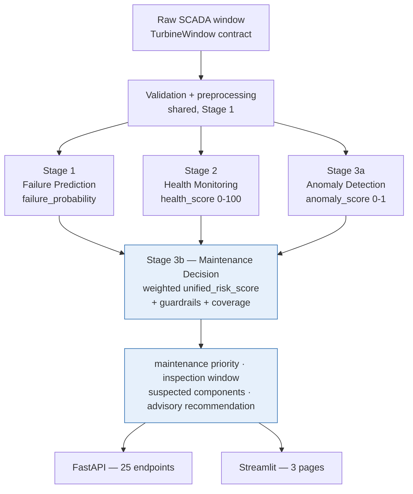

# Project Handoff — Integration Contract

**Platform version:** 1.0.0
**Status:** all three modules complete
**Last verified:** 2026-07-30 (full audit: pipelines, tests, API, dashboard, Docker)

This is the entry point for the handoff set. It explains how the three modules fit
together and which contracts are shared. Per-module detail lives in the stage documents.

| Stage | Module | Owner | Handoff |
|---|---|---|---|
| 1 | Failure Prediction | Ozan ([@onurozansunger](https://github.com/onurozansunger)) | [`OZAN_STAGE1_HANDOFF.md`](OZAN_STAGE1_HANDOFF.md) |
| 2 | Turbine Health Monitoring | Şahin ([@SBRKBNL](https://github.com/SBRKBNL)) | [`SAHIN_STAGE2_HANDOFF.md`](SAHIN_STAGE2_HANDOFF.md) |
| 3 | Anomaly Detection & Maintenance Decision | Emir ([@emirdikmen](https://github.com/emirdikmen)) | [`EMIR_STAGE3_HANDOFF.md`](EMIR_STAGE3_HANDOFF.md) |

---

## 1. How the modules interact

Every module consumes **the same raw SCADA window** and produces an independent
assessment. Stage 3 combines them; it does not replace them.



**The key integration rule:** a missing module is *not* zero risk. `MaintenanceService`
renormalises the weights over the modules that actually answered and reports `coverage`
plus `missing_modules`, so a partial assessment is visibly partial rather than silently
optimistic.

---

## 2. Shared contracts

These are owned by the platform, not by one stage. Changing one is a breaking change for
everybody — coordinate first.

| Contract | Where | Used by |
|---|---|---|
| `TurbineObservation`, `TurbineWindow` | `contracts/observations.py` | all three |
| `BasePrediction` (+ `advisory_only`) | `contracts/predictions.py` | all three |
| `ModelMetadata` | `contracts/metadata.py` | all three |
| Column names, enums, units, disclaimer | `constants.py` | all three |
| Validation + preprocessing | `data/validation.py`, `data/preprocessing.py` | all three |
| Leakage-safe temporal primitives | `features/transformers.py` | all three |
| Path / IO / config / logging / seeding | `utils/`, `config.py`, `logging_config.py` | all three |

Each module then owns its own namespace: `models/` + `features/failure_features.py`
(Stage 1), `health/` (Stage 2), `anomaly/` + `services/maintenance_service.py` (Stage 3).

### Configuration namespacing

`load_config()` returns the **Stage 1** configuration only. Each module has its own
loader that merges the files it needs — use the one for your module:

```python
from wind_turbine_pm.config import load_config  # data + features + failure_model
from wind_turbine_pm.health.config import get_health_config  # + health_model
from wind_turbine_pm.anomaly.config import get_anomaly_config  # + anomaly_model + maintenance
```

Passing a Stage 1 config to a Stage 2/3 service raises `ConfigError` naming the missing
key. Services default to the correct loader when you pass nothing.

---

## 3. Output contracts at a glance

Field names as actually returned by the API (verified against a running server).

| Module | Endpoint | Primary fields |
|---|---|---|
| Failure | `POST /failure/predict` | `failure_probability`, `prediction`, `risk_level`, `threshold`, `top_risk_factors`, `explanation`, `recommendation` |
| Health | `POST /health-monitoring/assess` | `health_score`, `health_class`, `component_health`, `operating_regime`, `drift_signals`, `rule_violations`, `data_quality` |
| Anomaly | `POST /anomaly/detect` | `anomaly_score`, `raw_anomaly_score`, `is_anomaly`, `severity`, `warning_threshold`, `alarm_threshold`, `contributing_signals` |
| Maintenance | `POST /maintenance/assess` | `unified_risk_score`, `risk_level`, `coverage`, `missing_modules`, `guardrails_triggered`, `component_scores`, nested `failure`/`health`/`anomaly`, `recommendation` |

Every response carries `turbine_id`, `timestamp`, `model_version` and
`advisory_only: true`. `advisory_only` is a structural constant, not configurable.

---

## 4. Artifacts

All paths come from configuration; use the module's `persistence.py` accessors rather
than literals.

| Module | Model | Metadata | Metrics |
|---|---|---|---|
| Failure | `artifacts/models/failure_model.joblib` | `failure_model_metadata.json`, `failure_threshold.json` | `failure_metrics.json` |
| Health | `health_model.joblib`, `health_drift_detector.joblib` | `health_model_metadata.json` | `health_metrics.json` |
| Anomaly | `anomaly_model.joblib`, `anomaly_reference.parquet` | `anomaly_model_metadata.json`, `anomaly_score_calibration.json` | `anomaly_metrics.json` |

Artifacts are git-ignored and reproducible from a seed. `load_bundle()` compares the
runtime's `scikit-learn`/`numpy`/`joblib` versions against those recorded at training
time and surfaces mismatches in logs and in `GET /health`.

---

## 5. Commands

```bash
make install-dev      # runtime + pytest/ruff  (make install omits the dev tooling)
make pipeline-all     # one shared raw dataset -> failure -> health -> anomaly
make test             # 429 tests
make lint

make api              # http://localhost:8000/docs
make dashboard        # http://localhost:8501
docker compose up --build
```

Downstream pipelines deliberately **do not** regenerate raw data, so all three modules
are trained and evaluated on the same fleet. Run one module with `make pipeline`,
`make health-pipeline` or `make anomaly-pipeline`.

---

## 6. Adding a fourth module

The platform is built to extend without touching existing modules:

1. `contracts/<module>.py` — subclass `BasePrediction`, keep `advisory_only`.
2. `configs/<module>_model.yaml` + a `<module>/config.py` loader listing the files it merges.
3. Reuse `features/transformers.py`; **add a leakage test** for any new temporal feature.
4. `<module>/persistence.py` with path accessors; prefix artifacts with the module name.
5. `services/<module>_service.py` — the single prediction path for that module.
6. `api/routers/<module>.py` exposing `router` and `router_description()`, then append one
   entry to `MODULE_ROUTERS` in `api/main.py`.
7. `dashboard/pages/<module>.py` exposing `render()`, then one entry in `PAGES`.
8. Register it in `MaintenanceService` weights if it should influence unified risk.

Nothing else in the platform needs to change.

---

## 7. Platform-wide limitations

Per-module limitations are in each stage handoff and model card. These apply to everything:

- **Synthetic data.** No result is evidence of real-world performance.
- **Advisory only.** No output may trigger automated action on plant.
- **Weights and costs are policy, not economics.** The unified-risk weights
  (failure 0.50 / anomaly 0.30 / health 0.20, in `configs/maintenance.yaml`) and the
  failure cost matrix are configurable assumptions, never validated against a real
  operator's maintenance costs.
- **The health model's target is a synthetic proxy.** Real deployment needs targets from
  inspection reports, work orders, component replacement history, oil analysis or expert
  labels — see [`MODEL_CARD_HEALTH.md`](MODEL_CARD_HEALTH.md).
- **Single site, single simulated year.** No seasonal generalisation can be claimed.
- **No drift monitoring of the models themselves** (sensor drift is detected; model decay
  is not).

---

## 8. Files to leave alone

See [`OZAN_STAGE1_HANDOFF.md`](OZAN_STAGE1_HANDOFF.md) §9 for the full colour-coded list.
Summary: shared contracts, `constants.py`, `config.py` and `utils/` are 🔴 coordinate-first;
`api/main.py` and `dashboard/app.py` are 🟡 append-only; your own module namespace is 🟢 yours.
